# Portage du template dans Joomla.

## 1. <u>Objectif</u>: 
Il est interessant de porter le template sous Joomla (ou un autre CMS) car cela permettrait à une personne non developpeur 
de modifier les contenus du site. Dans ce tutorial, nous allons travailler sur Joomla (à venir wordpress).

## 2. <u>Installation de l'environnement</u>: 
 Pour éviter d'installer une LAMPP stack sur notre machine, nous allons avoir recours à docker.
 Le document de référence est ici: https://doc.ubuntu-fr.org/docker_lamp (je ne fais que recopier cette partie et éventuellement, reformuler ou clarifier des parties)

### 2.a. Installation de docker
Debian n'intègre pas par défaut le répository contenant Docker Engine. ON peut donc installer docker de plusieurs manières mais nous allons utiliser la méthode où on met à jour notre repository.

(le document de référence est https://docs.docker.com/install/linux/docker-ce/debian/ pour cette installation)

- Desinstaller les paquets Docker éventuellement installés sur la machine:
```bash
    patou@pc-pa:~$ sudo apt-get purge docker lxc-docker docker-engine docker.io
```
- Mettre à jour les paquets installés pour utiliser des repository en https:
```bash
    patou@pc-pa:~$ sudo apt install apt-transport-https ca-certificates curl software-properties-common gnupg2
```
- On va récupérer le certificat officiel de Docker (pour nous assurer qu'on installe bien la version offcielle). Pour cela, nous allons télécharger la clé GPG officiel.
```bash
    patou@pc-pa:~$ curl -fsSL https://download.docker.com/linux/debian/gpg | sudo apt-key add -
```
- Vérifions que la commande `apt-key add - ` nous a rajouté la clé officielle de Docker (9DC8 5822 9FC7 DD38 854A E2D8 8D81 803C 0EBF CD88). pour cela, on donne à la commande `apt-key fingerprint` les 6 derniers octets de la clé.
 ```bash
    patou@pc-pa:~$ sudo apt-key fingerprint 0EBFCD88
    pub   rsa4096 2017-02-22 [SCEA]
          9DC8 5822 9FC7 DD38 854A  E2D8 8D81 803C 0EBF CD88
    uid           [ unknown] Docker Release (CE deb) <docker@docker.com>
    sub   rsa4096 2017-02-22 [S]
 ```
Donc on a bien la clé qui est installé. Cela nous permet de nous assurer qu'on isntallera bien la version officielle de Docker. 

- Mettre à jour notre fichier `/etc/apt/sources.list` pour nous permettre l'installation de Docker.
Pour rajouter une ligne dans ce fichier de configuration, on peut utiliser la commande `apt-add-repository`ou `add-apt-repository`. La ligne que nous voudrions rajouter dans `sources.list` est la suivante:
`deb [arch=amd64] https://download.docker.com/linux/debian stretch stable` 
qu'on pourrait rajouter à la main en tant que root ou qu'on pourrait rajouter en ligne de commande comme suit:
```bash
    patou@pc-pa:~$ sudo add-apt-repository "deb [arch=amd64] https://download.docker.com/linux/debian $(lsb_release -cs) stable"
```
- mise à jour des repository et installation de Docker (enfin)
```bash
    patou@pc-pa:~$ sudo apt-get update
    Réception de:18 https://download.docker.com/linux/debian stretch/stable amd64 Packages [11,9 kB] 1 113 ko réceptionnés en 1s (1 028 ko/s)                                                         
    Lecture des listes de paquets... Fait
    patou@pc-pa:~$ sudo apt-get install docker-ce docker-ce-cli containerd.io
    Lecture des listes de paquets... Fait
    Construction de l'arbre des dépendances       
    Lecture des informations d'état... Fait
    Les paquets suivants ont été installés automatiquement et ne sont plus nécessaires :
      gconf2 gksu libgksu2-0 libglade2-0 net-tools python-glade2 python-gobject python-notify rfkill
    Veuillez utiliser « sudo apt autoremove » pour les supprimer.
    The following additional packages will be installed:
      aufs-dkms aufs-tools cgroupfs-mount dkms pigz
    Paquets suggérés :
      aufs-dev python3-apport menu
    Les NOUVEAUX paquets suivants seront installés :
      aufs-dkms aufs-tools cgroupfs-mount containerd.io dkms docker-ce docker-ce-cli pigz
    0 mis à jour, 8 nouvellement installés, 0 à enlever et 4 non mis à jour.
    Il est nécessaire de prendre 22,8 Mo/85,7 Mo dans les archives.
    Après cette opération, 385 Mo d'espace disque supplémentaires seront utilisés.
    Souhaitez-vous continuer ? [O/n]
```
A partir de ce moment, Docker est installé.

- test de l'installation (installation d'une application helloworld):
```bash
    patou@pc-pa:~/Documents/docker_course$ sudo docker run hello-world
```
Si l'installation est OK, alors on verra le message `Hello from Docker!` en autres.
On peut également, voir si l'image docker de 'Hello world' est bien installé par la commande suivante:
```bash
    patou@pc-pa:~/Documents/docker_course$ sudo docker run hello-world
```
```bash
patou@pc-pa:~/Documents/docker_course$ sudo docker images
REPOSITORY          TAG                 IMAGE ID            CREATED             SIZE
hello-world         latest              fce289e99eb9        11 months ago       1.84kB
```

- Pour finir l'installation, on va donner les droits à notre compte utilisateur pour pouvoir manipuler les containers Docker. Cela nous permettra en tant qu'utilisateur de manipuler les containers. Cependant, cela posera aussi un problème de sécurité car cela pourrait permettre une escalation de privilège plus tard.
```sh
 patou@pc-pa:~/Documents/docker_course$ sudo usermod -aG docker $USER
```

### 2.b. Mise en place des répertoires de travail
Par défaut, les fichiers dockers ne sont pas persistantes (tout est oublié/réinitialisé à chaque lancement du conteneur).
L'intérêt de l'option -v (volume) de Docker est de créer une sorte de lien symbolique entre le conteneur et le système hôte, ainsi les fichiers modifiés par le conteneur seront persistés sur le système. En bref, nous pourrions, faire persister des configuration avec les liens symboliques.

 Commençons donc par créer des répertoires pour le contenu que l'on souhaite modifier et conserver, en l'occurrence les fichiers du site et les bases de donnés : 
 
 ```bash
 mkdir -p ~/Documents/docker_cours/www ~/Documents/docker_cours/mysql
 ```
 ```bash
 patou@pc-pa:~/Documents$ cd ~/Documents/docker_cours
 ```
 ```bash
    patou@pc-pa:~/Documents/docker_cours$ tree
    .
    ├── mysql
    └── www

    2 directories, 0 files
```

### 2.c. Installation de la LAMPP Stack
- <u>méthode simple (pour la documentation mais à ne pas faire)</u>

    LAMPP peut être installé de deux manières (méthode simple et avancée)

    La méthode simple consiste à juste télécharger un container tout prêt (à partir de https://hub.docker.com/r/lioshi/lamp/) et de l'utiliser. Ce container est basée sur *Debian Jessie, PHP 5, Apache 2,* et *MySQL*.
    La commande pour la méthode simple est :
    ```bash
    docker run -v ~/Documents/docker_cours/www:/var/www/html -v ~/Documents/docker_cours/mysql:/var/lib/mysql -p 80:80 -p 3306:3306 --restart=always lioshi/lamp:php5
    ```
    L'option **-v** (volume) relie les répertoires locaux ~/Documents/docker_cours/www et ~/Documents/docker_cours/mysql aux répertoires /var/www/html et /var/lib/mysql de l'image Debian dans le conteneur.
    L'option **-p** (port) relie les ports qui nous intéressent du conteneur aux ports de notre machine locale. Ici le port 80 (HTTP) et le port 3306 (MySQL).

    L'option **–restart=always** permet de relancer le conteneur à chaque démarrage de Docker (donc au démarrage de l'ordinateur, la nouvelle LAMPP stack est toujours lancée). 

    Quand cette commande est lancée, Linux télécharge le container et la LAMPP stack peut s'utiliser ensuite directement. On peut accéder à notre serveur web à partir de http://localhost
    
    La base de donnée sera alors sauvegardé sur ~/Documents/docker_cours/mysql.
    PhpMyAdmin est accessible sur http://localhost/phpmyadmin
    Avec cette image Docker l'utilisateur par défaut pour les bases de données devrait être **admin** avec le mot de passe **admin** (hôte localhost). 
    
- <u>méthode avancée</u>:
    Il est recommandé d'avoir un container par executables autant que possible. Donc nous avons besoin d'une image pour *Apache* avec *PHP*, une image pour *MySQL* et une image pour *phpMyAdmin*. 
        
    Pour Apache/PHP nous allons choisir l'image fournie ici (https://hub.docker.com/r/lavoweb/php-5.6/).
    Pour MySQL, nous pouvons prendre l'image fournie officiellement par MySQL, en version 5.5 (https://hub.docker.com/_/mysql/).
    Pour phpMyAdmin, nous pouvons aussi choisir l'image officielle (https://hub.docker.com/r/phpmyadmin/phpmyadmin/).

    #### 2.c.1.  Installation de docker-compose
     `docker-compose`est un outil qui permet de combiner plusieurs containers en un seul container.
     ```bash     
     patou@pc-pa:~/Documents/docker_cours$ sudo apt-get install docker-compose
     ```
    #### 2.c.2.  Creation d'un fichier docker-compose.yml
            
    Le contenu de notre fichier `docker-compose.yml` est:
    
    ```
    version: '2'

    services:
        web:
            image: lavoweb/php-5.6
            ports:
                - "80:80"
            volumes:
                - ~/Documents/docker_cours/www:/var/www/html
            links:
                - db:db
        db:
            image: mysql:5.5
            volumes:
                - ~/Documents/docker_cours/mysql:/var/lib/mysql
            ports:
                - "3306:3306"
            environment:
                - MYSQL_ROOT_PASSWORD=root
        myadmin:
            image: phpmyadmin/phpmyadmin
            ports:
                - "8080:80"
            links:
                - db:db
    ```
    - Explication:
        Les services sont des conteneurs: **web**, **db** et **myadmin** sont les noms qu'on décide de leur donner.

        Ces noms sont utilisés pour créer des liens - **links** - entre les différents conteneurs. Par ex. **db:db** signifie que notre conteneur db (du nom de notre conteneur MySQL) correspondra à l'hôte db dans notre conteneur web. Pour se connecter au serveur MySQL il faudra donc entrer **db** comme nom d'hôte.

        On peut également passer des variables d'environnements à nos conteneurs. Ici nous définissons le mot de passe de l'utilisateur MySQL root comme étant root (par `MYSQL_ROOT_PASSWORD` comme variable d'environnement)

        Le paramètre **volumes** relie les répertoires locaux `~/Documents/docker_cours/www` et `~/Documents/docker_cours/mysql` aux répertoires `/var/www/html` de l'image Apache/PHP et `/var/lib/mysql` de l'image MySQL dans nos conteneurs. Cela correspond à l'options **-v** de la ligne de commande, décrit dans la méthode simple. 

        Et le paramètre **ports** de la même manière que l'options **-p**, relie les ports qui nous intéressent de nos conteneurs aux ports de notre machine locale. Ici le port 80 (HTTP) et le port 3306 (MySQL). 
    
  #### 2.c.3.  Lancement des containers
  
  Une fois que le fichier yml est mis en place, on peut lancer les containers.
    ```bash
        patou@pc-pa:~/Documents/docker_cours$ sudo docker-compose up
        Creating network "dockercours_default" with the default driver
        Pulling db (mysql:5.5)...
        5.5: Pulling from library/mysql
        743f2d6c1f65: Pull complete
        3f0c413ee255: Pull complete
        aef1ef8f1aac: Pull complete
        f9ee573e34cb: Pull complete
        3f237e01f153: Pull complete
        03da1e065b16: Pull complete
        04087a801070: Pull complete
        7efd5395ab31: Pull complete
        1b5cc03aaac8: Pull complete
        2b7adaec9998: Pull complete
        385b8f96a9ba: Pull complete
        Digest: sha256:12da85ab88aedfdf39455872fb044f607c32fdc233cd59f1d26769fbf439b045
        Status: Downloaded newer image for mysql:5.5
        Pulling myadmin (phpmyadmin/phpmyadmin:latest)...
        latest: Pulling from phpmyadmin/phpmyadmin
        000eee12ec04: Downloading [==========================>                        ]  14.23MB/27.09MB
        8ae4f9fcfeea: Download complete
        60f22fbbd07a: Downloading [========>                                          ]  12.87MB/76.65MB
    ```
    
    Il faut attendre une peu que les images soient téléchargées, et c'est tout ! Notre serveur est en route. 
    
    (Je ne sais pas pourquoi mais mon serveur web n'arrivati pas à atteindre ma page sans reboot - peut-être à cause du fait que je viens d'installer docker from scratch)
    
    **<u>Rappel:</u>** 
    Nous savons que les containers docker ne sont pas persistant par défaut. Cela siginifie que lorsque nous modifions le container en cours d'utilisation, ces modifications seront perdues si on redemarre le container.
    Pour pouvoir rajouter des fichiers à notre LAMPP stack, nous avons donc utilisé la section "volumes" dans le fichier yml.
    
    #### 2.c.4.  Tester Apache
    Pour tester apache, nous allons créer un fichier index.php dans `~/Documents/docker_cours/www`. 
    On va aller dans un navigateur et taper `http://localhost` mais on n'aura rien en réponse car on n'a pas de page à voir.
    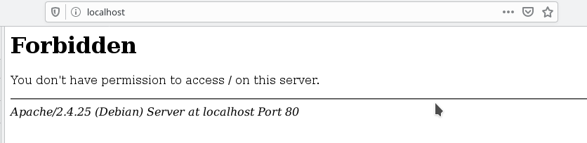
    
    Nous allons donc, juste créer un fichier `index.php` dedans afin de tester notre serveur web.
    
     ```php
        <html>
          <head>
            <title></title>
            <meta content="">
            <style></style>
          </head>
          <body>
            <?php
                phpinfo();
            ?>
          </body>
        </html>
     ```
    Après la création du fichier, il faut éteindre et redemarrer le seveur.
    
    ```bash 
    patou@pc-pa:~/Documents/docker_cours$ docker-compose down
    Stopping dockercours_web_1 ... done
    Stopping dockercours_myadmin_1 ... done
    Stopping dockercours_db_1 ... done
    Removing dockercours_web_1 ... done
    Removing dockercours_myadmin_1 ... done
    Removing dockercours_db_1 ... done
    Removing network dockercours_default
    patou@pc-pa:~/Documents/docker_cours$ docker-compose up -d
    Creating network "dockercours_default" with the default driver
    Creating dockercours_db_1
    Creating dockercours_myadmin_1
    Creating dockercours_web_1
    ```
    
    Et maintenant:
    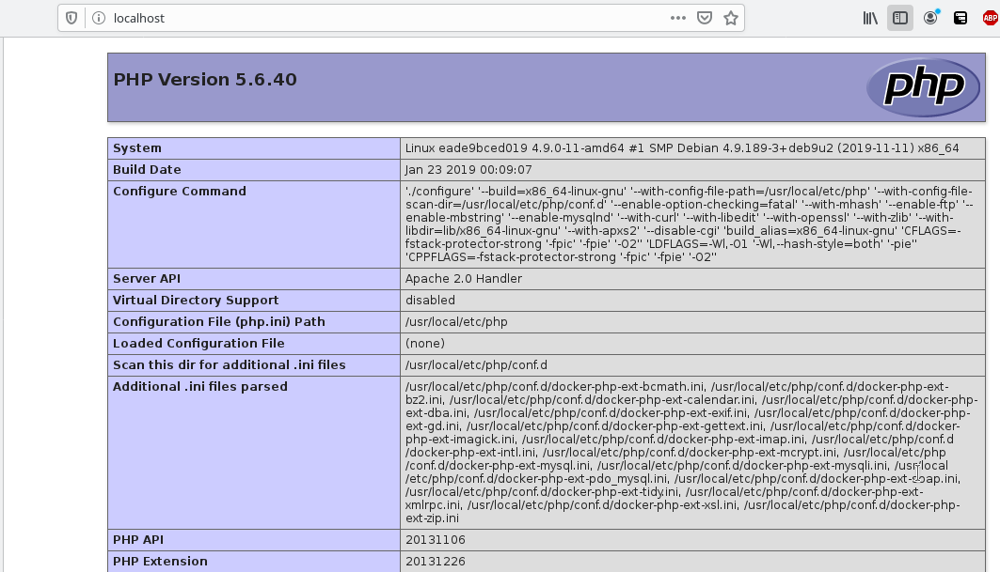
    
    Et pour PhpMyAdmin, on a également localhost mais avec le port 8080 (voir fichier yml). Le login/mot de passe est: root root
    
    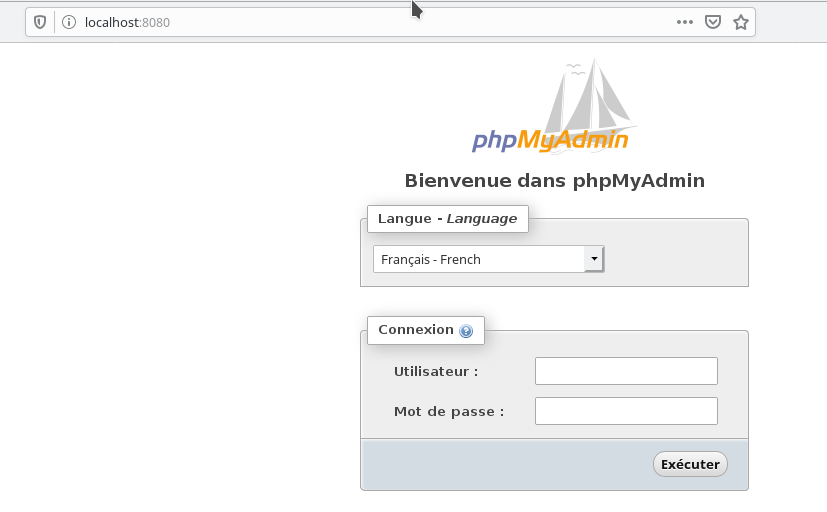
    
    #### 2.c.5.  Accéder à notre stack LAMPP en ligne de commande
    Il pourrait être utile de savoir comment accéder à chaque process de notre docker machine.
    - Si je souhaiterais accéder à ma base SQL en ligne de commande:
      il faut retrouver le nom du module dans le fichier `docker-compose.yml` (ici c'est `db`). La commande est la suivante, et le résultat est une console de commande en tant que `root` à notre machine linux qui contient le process de database.
      
        ```bash
        patou@pc-pa:~/Documents/docker_cours$ docker-compose exec db /bin/bash
        root@fc5b8b4b8c94:/# 

        ```
     Pour sortir de la machine, il faut taper `exit`. 
     Nous allons essayer de nous connecter au processus `mysql`en mode console. Nous allons nous connecter en tant qu'utilisateur `root`
        
     ```bash
        patou@pc-pa:~/Documents/docker_cours$ docker-compose exec db /bin/bash
        root@fc5b8b4b8c94:/#mysql -u root -p
        Enter password: 
        Welcome to the MySQL monitor.  Commands end with ; or \g.
        Your MySQL connection id is 1
        Server version: 5.5.62 MySQL Community Server (GPL)

        Copyright (c) 2000, 2018, Oracle and/or its affiliates. All rights reserved.

        Oracle is a registered trademark of Oracle Corporation and/or its
        affiliates. Other names may be trademarks of their respective
        owners.

        Type 'help;' or '\h' for help. Type '\c' to clear the current input statement.

        mysql>
    ```
     
    On peut également afficher toutes les bases de données dans notre `MySQL`
     ```bash
        mysql> show databases;
        +--------------------+
        | Database           |
        +--------------------+
        | information_schema |
        | mysql              |
        | performance_schema |
        +--------------------+
        3 rows in set (0.00 sec)
     ```
     
  - De la même manière, on pourra accéder au service web (apache), lire les fichiers de configurations (ou les modifier). Les modifications seront persistantes si on modifie la machine. ( à remarquer que les 2 fichiers que nous voyons ci-dessous sont nos )
     ```bash
        patou@pc-pa:~/Documents/docker_cours$ docker-compose exec web /bin/bash
        root@f82fea97bcb2:/var/www/html# ls
        index.html  index.php
        root@f82fea97bcb2:/var/www/html# exit
     ```

### 2.d Installation de Joomla

On télécharge joomla sur https://downloads.joomla.org/fr. Nous allons créer un répertoire joomla dans `www`, et y décompresser les fichiers fournis dans le fichier joomla.zip.
Il faut ensuite s'assurer qu'on a les accès correctes. Pour cela, il faudra que joomla ait l'accès en écriture au répertoire et sous-répertoire dans joomla. 

Relancer nos serveurs par la commande `docker-compose up -d`
Ouvrez le serveur web en mode ligne de commande: c'est le service nommé `web` dans le fichier yml.
   ```bash
   patou@pc-pa:~/Documents/docker_cours/www$ docker-compose exec web /bin/bash
   ```
   à partir de là, nous avons une console en mode root qui est notre serveur web.
   
   ```bash
   root@a0d8ce0e9193:/var/www/html# ls -la
    total 13632
    drwxr-xr-x  3 1000 1000     4096 Dec 29 11:57 .
    drwxr-xr-x  1 root root     4096 Nov 22 15:47 ..
    -rwxr-xr-x  1 1000 1000 13942196 Dec 20 10:28 Joomla_3.9.11-Stable-Full_Package.zip
    -rwxr-xr-x  1 1000 1000       24 Dec 20 14:56 index.php
    drwxr-xr-x 18 1000 1000     4096 Dec 29 11:57 joomla
   root@a0d8ce0e9193:/var/www/html# cd joomla/
   root@a0d8ce0e9193:/var/www/html/joomla# ls -la
    total 116
    drwxr-xr-x 18 1000 1000  4096 Dec 29 11:57 .
    drwxr-xr-x  3 1000 1000  4096 Dec 29 11:57 ..
    -rw-r--r--  1 1000 1000 18092 Dec 17 09:01 LICENSE.txt
    -rw-r--r--  1 1000 1000  4793 Dec 17 09:01 README.txt
    drwxr-xr-x 11 1000 1000  4096 Dec 29 11:57 administrator
    drwxr-xr-x  2 1000 1000  4096 Dec 29 11:57 bin
    drwxr-xr-x  2 1000 1000  4096 Dec 29 11:57 cache
    drwxr-xr-x  2 1000 1000  4096 Dec 29 11:57 cli
    drwxr-xr-x 20 1000 1000  4096 Dec 29 11:57 components
    -rw-r--r--  1 1000 1000  3159 Dec 17 09:01 htaccess.txt
    drwxr-xr-x  5 1000 1000  4096 Dec 29 11:57 images
    drwxr-xr-x  2 1000 1000  4096 Dec 29 11:57 includes
    -rw-r--r--  1 1000 1000  1420 Dec 17 09:01 index.php
    drwxr-xr-x 14 1000 1000  4096 Dec 29 11:57 installation
    drwxr-xr-x  4 1000 1000  4096 Dec 29 11:57 language
    drwxr-xr-x  5 1000 1000  4096 Dec 29 11:57 layouts
    drwxr-xr-x 12 1000 1000  4096 Dec 29 11:57 libraries
    drwxr-xr-x 30 1000 1000  4096 Dec 29 11:57 media
    drwxr-xr-x 27 1000 1000  4096 Dec 29 11:57 modules
    drwxr-xr-x 19 1000 1000  4096 Dec 29 11:57 plugins
    -rw-r--r--  1 1000 1000   829 Dec 17 09:01 robots.txt.dist
    drwxr-xr-x  5 1000 1000  4096 Dec 29 11:57 templates
    drwxr-xr-x  2 1000 1000  4096 Dec 29 11:57 tmp
    -rw-r--r--  1 1000 1000  1859 Dec 17 09:01 web.config.txt
   root@a0d8ce0e9193:/var/www/html/joomla# 
   ```
   On remarque que seul le propriétaire du répertoire (donc l'utilisateur créateur) peut écrire dedans (pour plus de compréhension, voir ici: https://www.it-connect.fr/les-droits-sous-linux ). Il faudra donner les droits d'écriture aux `autres` utilisateurs. 
   
   ```bash
   root@a0d8ce0e9193:/var/www/html# chmod 777 -R joomla/
   root@a0d8ce0e9193:/var/www/html# ls -la
    total 13632
    drwxr-xr-x  3 1000 1000     4096 Dec 29 11:57 .
    drwxr-xr-x  1 root root     4096 Nov 22 15:47 ..
    -rwxr-xr-x  1 1000 1000 13942196 Dec 20 10:28 Joomla_3.9.11-Stable-Full_Package.zip
    -rwxr-xr-x  1 1000 1000       24 Dec 20 14:56 index.php
    drwxrwxrwx 18 1000 1000     4096 Dec 29 11:57 joomla
   root@a0d8ce0e9193:/var/www/html# cd joomla
   root@a0d8ce0e9193:/var/www/html/joomla# ls -la
    total 116
    drwxr-xr-x 18 1000 1000  4096 Dec 29 11:57 .
    drwxr-xr-x  3 1000 1000  4096 Dec 29 11:57 ..
    -rwxrwxrwx  1 1000 1000 18092 Dec 17 09:01 LICENSE.txt
    -rwxrwxrwx  1 1000 1000  4793 Dec 17 09:01 README.txt
    drwxrwxrwx 11 1000 1000  4096 Dec 29 11:57 administrator
    drwxrwxrwx  2 1000 1000  4096 Dec 29 11:57 bin
    drwxrwxrwx  2 1000 1000  4096 Dec 29 11:57 cache
    drwxrwxrwx  2 1000 1000  4096 Dec 29 11:57 cli
    drwxrwxrwx 20 1000 1000  4096 Dec 29 11:57 components
    -rwxrwxrwx  1 1000 1000  3159 Dec 17 09:01 htaccess.txt
    drwxrwxrwx  5 1000 1000  4096 Dec 29 11:57 images
    drwxrwxrwx  2 1000 1000  4096 Dec 29 11:57 includes
    -rwxrwxrwx  1 1000 1000  1420 Dec 17 09:01 index.php
    drwxrwxrwx 14 1000 1000  4096 Dec 29 11:57 installation
    drwxrwxrwx  4 1000 1000  4096 Dec 29 11:57 language
    drwxrwxrwx  5 1000 1000  4096 Dec 29 11:57 layouts
    drwxrwxrwx 12 1000 1000  4096 Dec 29 11:57 libraries
    drwxrwxrwx 30 1000 1000  4096 Dec 29 11:57 media
    drwxrwxrwx 27 1000 1000  4096 Dec 29 11:57 modules
    drwxrwxrwx 19 1000 1000  4096 Dec 29 11:57 plugins
    -rwxrwxrwx  1 1000 1000   829 Dec 17 09:01 robots.txt.dist
    drwxrwxrwx  5 1000 1000  4096 Dec 29 11:57 templates
    drwxrwxrwx  2 1000 1000  4096 Dec 29 11:57 tmp
    -rwxrwxrwx  1 1000 1000  1859 Dec 17 09:01 web.config.txt
   ```

On va aller dans `http://locahost/joomla` et le programme d'installation de joomla commence. Vous remplirez avec les informations qui correspondent à votre site. J'ai aussi mis `admin` et `admin` pour le compte super-utilisateur.(ATTENTION: si vous décompressez dans un autre répertoire, il faudra mettre ce répertoire dans l'adresse également `http://locahost/repertoire`)

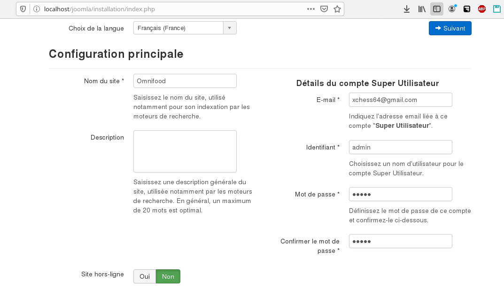

Et cliquez `suivant`
Avant d'aller créer la base de donnée, pensez à vérifier dans phpmyadmin (`http://localhost:8080`) que la base de donnée que vous souhaitez créer n'est pas déjà existant.

L'étape 2 consiste à configurer la base de données MySQL (le nom d'utilisateur de notre base MySQL est root - souvenez-vous et sont mot de passe est aussi root). 
Pour tester nous allons garder cela (même si la plus raisonnable en terme de sécurité est de créer un utilisateur et de faire une commande SQL )
J'ai nommé ma base de donnée `Omnifood`. Il faudra créer cette base en utilisant soit la ligne de commande `MySQL`soit `PhpMyAdmin`. Nous allons utiliser `phpMyAdmin` dans une autre page.

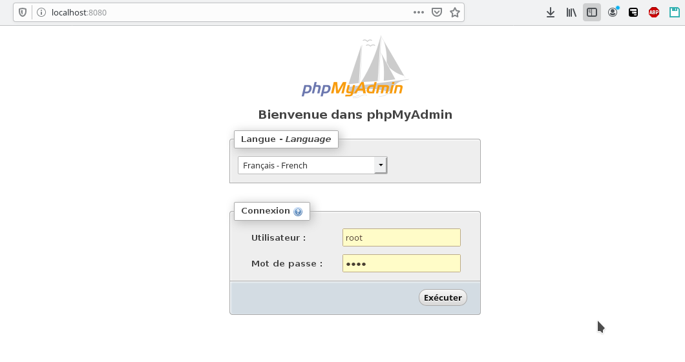. 

Juste pour remarquer que nous avons bien la même base de donnée que ce que nous accédons en ligne de commande dans phpmyAdmin car on retrouve bien la même liste de bases de données dans PhpMyAdmin et dans MySQL en ligne de commande:

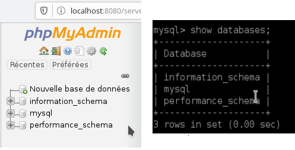


Nous allons ensuite commencer par créer un utilisateur autre que root: que nous allons appeler `devsite` et dont le mote de passe est `devsite` et dans privileges, nous allons donner tous les droits pour commencer (plus tard, il faudra limiter ces droits)

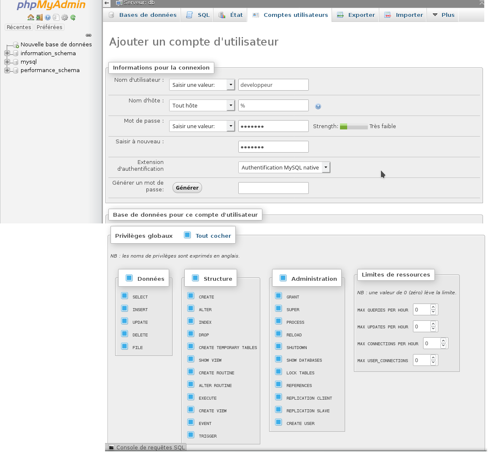

Cliquer ensuite sur `Executer` pour rajouter l'utilisateur. Deconnectez-vous de phpMyAdmin et reconnectez-vous avec l'utilisateur `developpeur`

Nous allons ensuite créer une base de données. Pour ma part, elle s'appelera `Omnifood`. Cliquez sur le menu de gauche `Nouvelle base de donnée` et nommez votre base de donnée selon le site et cliquez sur créer. Pas besoin de créer des tables, car joomla va les créer.
  
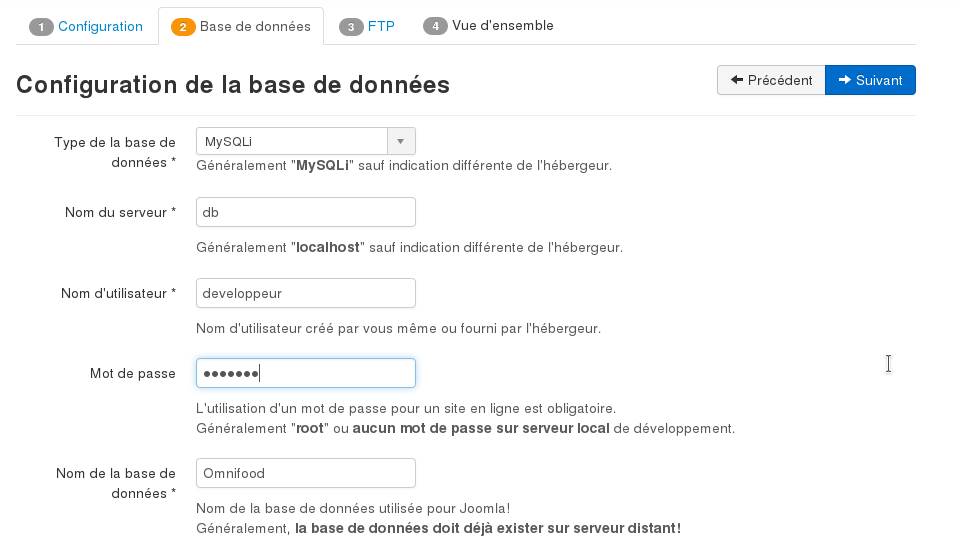
  
Le nom du serveur est le nom de la machine contenant la base de donnée (dans notrefichier yml, notre serveur de base de donnée est `db`. Le nom de la base est (pour moi) `Omnifood` et le nom d'utilisateur est `developpeur` et le mot de passe de cet utilisateur est `devsite`). 


Un dernier détail: il faut rajouter la ligne ci-dessous à nos services docker pour désactiver la vérification que fait Joomla sur les bases de données docker:
   ```
   environment:
        - JOOMLA_INSTALLATION_DISABLE_LOCALHOST_CHECK=1
   ```
Cliquez ensuite sur `Suivant`. Dans la troisième étape, ne rien toucher et cliquez sur `Suivant`. Et enfin dans l'étape 4, cliquez sur `Aucune donnée exemple`  et cliquez sur `Installation`. Attendre la fin de l'installation.

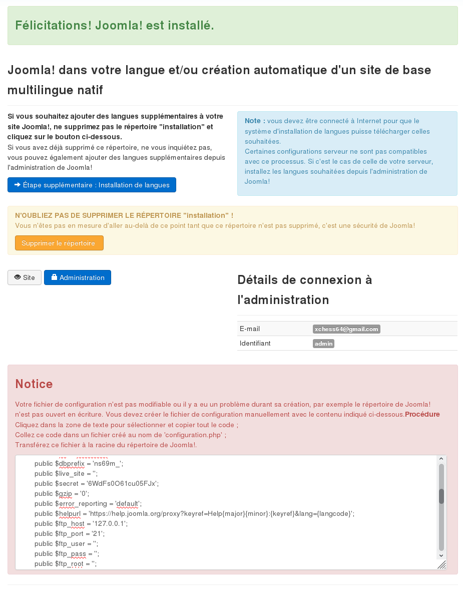 

ATTENTION: BIEN LIRE les instructions de fin d'installation jusqu'à la fin car il y a des choses à faire.

Une fois que l'installation est effectué, vous pourrez accéder à notre site sur `http://localhost/joomla/`
et à l'interface d'administration sur `http://localhost/joomla/administrator`
  
Remarque: Après l'installation de Joomla, on rencontre une erreur de version de php quand on rentre sur l'interface d'administration. Il faut remplacer la version de php par la version 7.3 pour se débarasser de ces erreurs. 

Après plusieurs essais avec différentes version de PHP, on rencontre un problème d'accès à la base MSySQL. 
Il faut alors qu'on remplace également notre base de donnée par une version de MariaDB.

Nous allons alors remplacer notre ficher docker-compose.yml comme ceci:
   ```
    version: '2.0'
    services:
            web:
                image: lavoweb/php-7.3
                ports:
                    - "80:80"
                volumes:
                    - ~/Documents/docker_cours/www:/var/www/html
                links:
                    - db:db
                environment:
                    - JOOMLA_INSTALLATION_DISABLE_LOCALHOST_CHECK=1
            db:
                image: mariadb:10.4
                volumes:
                    - ~/Documents/docker_cours/mysql:/var/lib/mysql
                ports:
                    - "3306:3306"
                environment:
                    - MYSQL_ROOT_PASSWORD=root
                    - JOOMLA_INSTALLATION_DISABLE_LOCALHOST_CHECK=1
            myadmin:
                image: phpmyadmin/phpmyadmin
                ports:
                    - "8080:80"
                links:
                    - db:db
                environment:
                    - JOOMLA_INSTALLATION_DISABLE_LOCALHOST_CHECK=1
   ```
  
  Nous avons remplacé la version de php par la version 7.3 et la base de donnée par MariaDB version 10.4.
  
  Ensuite, il nous faudra supprimer Joomla dans le répertoire www afin d'en installer une nouvelle après avoir recomposer notre machine docker par `docker-compose up -d` (`-d` signifie en mode détaché, c'est à dire que les services tournent en tâche de fond sans acaparer une console entière). Refaire ensuite toute la partie installation de Joomla en s'assurant de ne pas mettre le site exemple .
  
  A ce stade, vous devriez avoir un joomla installé et configuré (prêt à l'utilisation). 
  Vous devriez pouvoir tester cela sur `http://localhost/joomla/`, qui devrait nous donner un site exemple vide.
  
  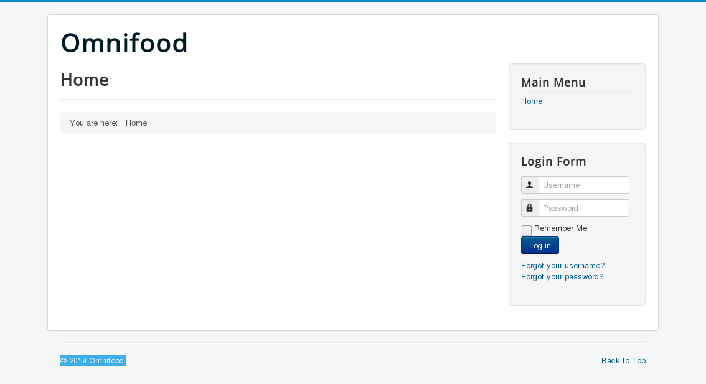 
  
  <u>Remarque:</u>:
  S'il vous arrive d'avoir les warnings suivants:
  
  ```bash
    patou@pc-pa:~/Documents/docker_cours$ docker-compose up -d
    Creating dockercours_db_1
    WARNING: Connection pool is full, discarding connection: localhost
    Creating dockercours_web_1
    WARNING: Connection pool is full, discarding connection: localhost
    Creating dockercours_myadmin_1
  ```
  
  La solution est la suivante: 
  
  ```bash
  patou@pc-pa:~/Documents/docker_cours$ export DOCKER_CLIENT_TIMEOUT=120
  patou@pc-pa:~/Documents/docker_cours$ docker-compose up -d
  dockercours_db_1 is up-to-date
  dockercours_web_1 is up-to-date
  dockercours_myadmin_1 is up-to-date 
  ```
   Plus de warning. Pour plus d'information, la doc est ici (https://github.com/docker/compose/issues/1045)
  
  ## 3. Formation Joomla pour commencer
  
  
  Avant de commencer, il faut savoir que ce cours est déjà assez ancien et fonctionne avc php5 et mysql5. il nous faudra donc modifier notre fichier `docker-compose.yml` comme suit:
  
  ```conf
version: '2'
services:
    web:
        image: lavoweb/php-5.6
        ports:
            - "80:80"
        volumes:
            - ~/Documents/docker_cours/www:/var/www/html
        links:
            - db:db
        environment:
            - JOOMLA_INSTALLATION_DISABLE_LOCALHOST_CHECK=1
    db:
        image: mysql:5.7
        volumes:
            - ~/Documents/docker_cours/mysql5:/var/lib/mysql
        ports:
            - "3306:3306"
        environment:
            - MYSQL_ROOT_PASSWORD=root
            - JOOMLA_INSTALLATION_DISABLE_LOCALHOST_CHECK=1
    myadmin:
        image: phpmyadmin/phpmyadmin
        ports:
            - "8080:80"
        links:
            - db:db
        environment:
            - JOOMLA_INSTALLATION_DISABLE_LOCALHOST_CHECK=1
  ```
  
  et relancer `docker-compose up -d`.
  
  ### 3.1. Restauration d'un site joomla à partir d'une sauvegarde
  Nous allons commencer par comprendre comment on peut restorer un site dans Joomla.
  (Avant d'apprendre à sauvegarder notre site, nous allons déjà apprendre ) le restaurer.
  
  Un site Joomla sauvegardé est composé de deux éléments: 
    - un fichier d'installation de joomla (zippé) qui contient déjà un site.
    - un fichier base de donnée (*.sql).
  
  Les 2 fichiers seront fournies en attachement à ce chapitre avec le commit.
  
  - Pour restaurer le site, il suffit de dezipper le fichier et de copier le fichier dans la racine du répertoire où nous mettons nos installations de Joomla (pour nous ce sera `www`) - Nous allons garder le nom du répertoire `01_05`. Si vosu lancer votre serveur LAMPP (dans docker) et que vous essayez d'utiliser le site, il y aura un problème car le site n'a pas de base de donnée (essayer d'entrer dans un navigateur `http://localhost/01_05`, vous aurez un message d'erreur  concernant la fonction `session_start()`).
  - Nous allons donc restaurer également la base de donnée de ce site. 
    * ouvrir phpmyadmin (`http://localhost:8080`), cliquez sur l'onglet `base de donnée`.
    * ouvrir le fichier `01_05/configuration.php` dans un éditeur et cherchez dans ce fichier le nom de la base de donnée et les mots de passe de la base de donnée. Nous nous interessons particulièrement aux données suivantes: 
    
    ``` java
        public $user = 'root';
        public $password = '';
        public $db = 'joomla';
    ```
    On va modifier `$password='root'`.
    * il nous faut également créer manuellement la base de donnée `joomla` dans phpmyadmin. Pour cela, cliquez, sur l'onglet `Base de données` et entrer le nom de la base de donnée (joomla) et cliquez sur `Créer`.
    
      
    * Vous allez alors trouver sur la partie de droite, la base de donnée nouvellement créée. Il faut maintenant importer le fichier sql. Pour cela, cliquez sur la base de donnée `joomla` et ensuite dans l'onglet `importer`. Ensuite vous avez un bouton `Parcourir...`et trouver le fichier `01_05.sql`. Ensuite tout en bas  de la page, cliquer sur `Executer`. Si tout s'est bien passé, on aura: `L'importation a réussi`.

    * enfin, en entrant sur le liens `localhost/01_05`, on a le site KinetECO qui s'affiche comme suit:
     .
    
#### a. Tour rapide de l'interface Joomla (on le fera ensemble-pas besoin de doc)
L'idée est de voir un à un les menus de Joomla et de comprendre le rôle de ces menus.

#### b. Configuration du site KinetECO dans Joomla
Ouvrez le backend de Joomla et allez dans Global Configuration (ou Menu Système > Global Configuration). Vous avez alors la possibilité de voir toutes les configurations du site. 

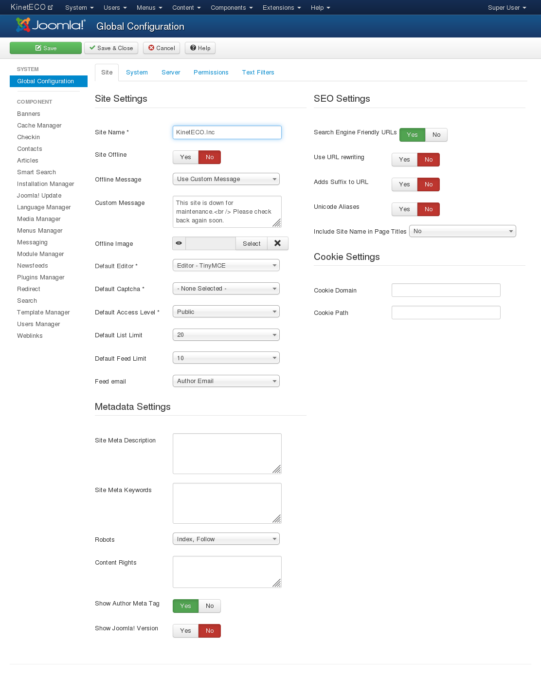.

- Commencer par changer le nom du site de `KinetECO` à `KinetECO, Inc.` dans la zone `Site Name`.
_ Modifier l'option `Site Offline` à `Yes`. Cela permettra de mettre un login à notre site si le site est maintenance et donc seul les personnes qui ont un login auront accès au site. (testez-le mais remettez l'option à `No` un fois que vous aurez fini de tester, pour avoir plus de faciliter à travailler en local).  
<br>Dans les options qui suivent, on peut également customiser un message d'erreur à afficher lorsque le site est en maintenance.
- <u>Sur la partie de droite on a `Search Engine Friendly URLs`</u> qui permet d'avoir des URL qui sont optimisés pour être référencés par les moteurs de recherche.
- <u>L'option `Include Site Name in Page Titles`</u>: est une option importante à activer. Cela permet d'avoir le nom du site avec le titre de la page. En effet, si vous ouvrez la page d'accueil de notre site, on a `Home` à l'onglet de notre page. Cependant, ce titre n'est pas un titre très descriptif de notre site. De plus, les moteurs de recherche donnent des points aux mots et si le titre n'est pas descriptif de notre site, il ne sert à rien. Il en est de même pour les favoris: si j'essaye de mettre cette page en favori, il y aura un titre `Home` dans mes favoris mais rien de très descriptif de ce que c'est. Pour toutes ces raisons, nous allons activer cette option à `Before` et sauvegarder la modification (bouton `Save` en dessus). Tester la modification en rafraichissant la page et vous verrez que le titre de la page sera `KinetECO,Inc. Home` (au lieu de `Home`).
- <u>Configuration des méta-data</u>: Dans la partie `Metadata Setting`, on peut configurer les metadata. et rajouter des mots clés ou des descriptions. Pour KinetEco, nous avons un fichier avec des metadata dans `Exercise Files/Chapter 2/02_03/meta description.txt`. Copier le contenu de ce fichier dans `Site Meta Description`. Ce méta description apparaitra sur toutes les pages de notre site suf si on décide de surcharger articles par articles (donc page par page) en définissant une meta description pour chaque article. Les meta description des sites doivent être courts et simple car ils sont utilisés par les moteurs de recherche pour référencer le site.

- Dans l'onglet `System` de l'option `Global Configuration`, on a `Session Settings`, et on y trouve `Session lifetime`, c'estle temps pour laquelle vous êtes loggé et si vous êtes inactif pendant le temps fourni, votre session est deconnecté. 
- Dans l'onglet `Server`, on a la possibilité de changer le fuseau horaire. Dans notre cas, on pourra choisir `Paris`au lieu de `UTC`. 
- On y retrouve également `Mail setting`. Il n'est pas recommandé de toucher aux configurations de `FTP` et de `Database`.
- Dans l'onglet `Permissions`, il existe plein de configuration que nous verrons en détails lorsque nous verrons les ACL (Access Control List).
- Le dernier onglet est `Text filter`, que nous verrons en détails également plus tard.


#### c. Utilisation du `Media manager`
Le `media manager` est l'interface qui vous permettra d'uploader des fichiers images (ou pdf) que vous servirez sur le site pour les usagers du site. C'est également à cet endroit que vous pourrez organiser ces documents par dossier.
Pour y accéder `System > Control Panel` et choisir `Media Manager`dans la partie de droite (ou à partir du menu `Content > Media Manager`). Par défaut, on a la structure qui s'affiche pour tous les sites.

(Prendre le fichier training.zip et décompresser dans un répertoire où vous pourrez y accéder)
Dans le répertoire racine, nous allons commencer par créer un répertoire nommé `blog`, en cliquant sur `create folder`. Ensuite, nous allons uploader les fichiers images qui sont dans `Exercise Files/Chapter 2/02_04/` et cliquez sur `Start Upload`. 

#### d. Creation d'un contenu sous Joomla 

Il faut les trois étapes CAM:
- créer une catégorie
- créer un article
- créer un menu pour lier avec l'article

L'ordre de ces étapes sont importantes car les données sont enregistrés dans la base de donnée. Il faut donc respecter l'ordre CAM.

 ### 3.2. Catégorization des éléments du site
 
 #### a. Creation des catégories dans Joomla
 La catégorization permet de définir les divers sections du site.
 Si à première vue, un menu conduit vers un ou plusieurs articles alors, il nous faut lui définir une catégorie pour cette section. Surtout si l'article est succeptible de changer dans le temps. 
 Egalement, si les sous-menu conduisent vers un ou plusieurs articles, alors, leur définir des sous-catégories.
  
 Pour le moment, nous allons définir des catégories pour chaque Menu de notre site (même si ces menus n'ouvrent pas de nouveaux articles mais conduisent à ds emplacements différentes sur notre page).

 Pour commencer, c'est une bonne idée de commencer avec votre sitemap (qu'il faudra construire si on n'en a pas). 
 Pour le site KinetEco, on peut trouver son sitemap dans `portage joomla > Chapter3 > site map.txt`. 
 Le contenu de fichier `sitemap` est:
 
 ```txt
    Home - Uncategorized category

    Products - Products category

    News & Info - News category
       Solar Blog - Solar category
       Press Releases - Press Release category

    About - About category
        Company Structure - About category
        Executives - About category

    Links - Weblinks component, no category needed

    Contact Us - Contact component, no category needed
  ```
 
 Nous allons donc créer les catégories qui sont dans ce fichier sitemap. 
 Pour cela, cliquez sur le bouton vert `New` et entrer le nom de la catégorie. Seul le nom est obligatoire, le reste est optionel. Ensuite, cliquez sur `Save and New` et continuez à créer toutes les autres catégories. Pour les sous-catégories de `News`, il faut choisir l'option `Parent` (dans la partie `Détails` en dessous du formulaire de création) et choisir le parent correct (en l'occurence, pour les sous-catégories de `News`, le parent est donc `News`).
 
 
En revenant dans `Content>Category Manager`, vous devriez  avoir:

.
 
 
#### b. Suppression catégories Joomla
Pour supprimer une catégorie, il faut passer par le ̀`Catégory Manager`, Cochez la petite checkbox à gauche et cliquer sur le bouton `Trash` dans la barre d'outil en dessus. La catégorie qu'on vient de supprimer est mis dans une catégorie spécifique invisible appelé `Trashed`. On peut le récupérer jusqu'à ce qu'on décide de le supprimer définitivement de cette catégorie. 
Pour le supprimer défitivement, il faut aller dans la partie filter (à gauche dans le Category Manager). 
Ensuite cliquer sur `Select Status` et choisir `Trashed`. Ensuite, il faut le selectionner en cochant la checkbox à gauche, et cliquer sur le bouton `Empty Trash`.

Pour le restaurer, il faut aller dans le status `Trashed` et cliquer sur le petit bouton `Trash` à gauche (Publish item). L'objet reviendra dans la liste des objets `published`.


### 3.3. Gestion des articles

#### a. Creation d'articles
Pour créer un article, il faut aller dans l'`article manager`. L'article manager peut se trouver dans `Content>Article Manager`. Pour créer un article, cliquer sur le bouton `New` en vert.

- Je vais commencer par créer mon article `About` et donc taper `About` dans la zone `Title` et choisir une catégorie `About`. C'est pour cela qu'il faut d'abord créer une catégorie avant les articles. Je vais récupérer les articles dans `portage_joomla/Chapter 4/04_01`. Prendre le fichier `About us copy.txt`. Copier toute la partie `Mission statements` et `Company description` dans le corps de l'article comme suit. Il faut penser à bien nettoyer les caractères bizarres qui sont dans l'éditeur.


Cliquer ensuite sur `Save and New` pour en créer un autre. 

Toujours dans la catégorie `About`, nous allons créer un autre article avec comme titre `Company structure` et le contenu est toujours dans le fichier `About us copy.txt`. 
Cliquer `Save and New`, une fois fini et continuer avec ̀`Executives` et son contenu dans le fichier texte.

- Continuons ensuite avec les articles dans le fichier `Products copy.txt`. Pour chaque titre, nous allons créer un article dans la catégorie `Product`.

Après ce stade, vous devriez avoir des articles comme suit, dans Joomla:


#### b. Formattage des articles
Aller dans `Article Manager`. Cliquer sur l'article `About` pour le mettre en forme. Cela va ouvrir l'editeur de texte de Joomla. 

Nous allons essayer de mettre le titre `Mission statement`en heading 1 (balise H1). Pour cela, nous allons procéder comme dans Word. Selectionner le texte et cliquer sur Paragraph et choisir ensuite `Heading 2`. On se rend compte que cela met en `<h1>` tout le texte.

Avant de continuer, il est important de comprendre que dans l'editeur de Joomla, le texte qu'on voit n'est pas le texte qui est rangé dans la base de donnée. Pour voir ce qui est rangé dans la base de donnée, on peut cliquer sur le bouton `Toggle editor`.

Cela nous permet de voir qu'une balise `<p>` `</p>` existe entre le début et la fin de tout le texte. 
Pour que la mise en forme fonctionne, il faut que les paragrapahes soient entre les éléments. Pour cela, mettre le curseur devant le mot KinetECO et taper `backspace` deux fois pour que ce texte monte jusqu'à 'Mission statement'. Ensuite redescendez de deux lignes. Faites de même pour tous les paragraphes à créer en dessous.  

Reessayer de selectionner le titre et choisir heading 1 dans la liste et là, le titre devrait être un peu plus gras tout seul. On peut revérifier avec `Toggle` 
Mettre le titre en `<h2>`et le texte en paragraph. et cliquer sur `Save and close`.

Faire la même chose pour l'article `Executives`. 


Ouvrir l'article `Company structure` et mettre ̀`KinetEco, Inc. Administrative Headquarters` en italic et souligné. Faire de même tous les débuts de paragraphe: Pour `KinetEco, Inc. Laboratories`, `KinetEco, Inc.`, `KinetEco, Inc.`

#### c. Configuration de l'éditeur de texte
Allez dans le menu `Extension > Plugin Manager`. Dans la liste, choisir ` Editor - TinyMCE `.  Passer dans l'onglet `Basic options` et Modifier `Functionality` à `Extended`. Ensuite revenez dans l'Article Manager (Rappel: Content > Article Manager et choisir un article). On obtiendra un ̀`Article Manager` un peu plus élaboré avec plus d'outils.

#### d. Créer un lien externe dans un article
Ouvrir l'article manager. 
Dans l'article `Executives`, nous avons, dans le paragraphe de `Simon Lodine, PhD, CEO ` (vers la fin), le texte Wind Powering America. C'est le nom d'une société. Comme la société possède un site web, nous allons lier ce nom à un lien.
Ouvrir le fichier `portage_joomla/Chapter 4/04_03/link.txt`. 

Selectionner le texte `Wind Powering America` et choisir le petit bouton lien (voir image ci-dessous)


Dans la partie url de la boite de dialogue qui s'ouvre, coller le lien et dans la partie `Target`, on va choisir si on doit ouvrir le lien dans une nouvelle fenetre ou dans un nouvel onglet ou dans la même page. Dans notre cas, nous allons l'ouvrir dans une nouvelle page et donc configurer comme dans l'image ci-dessous.

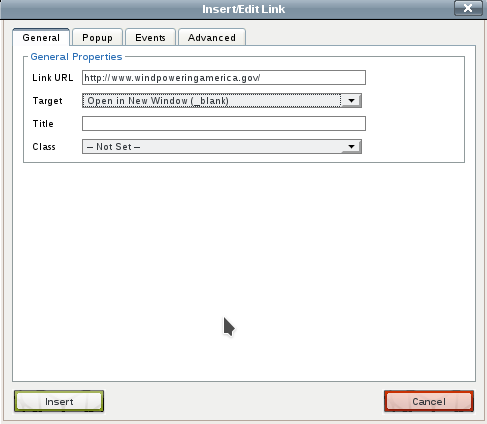

Pour tester, il faudra attendre que nous ayons mis notre article sur notre site (pour le moment, nous sommes seulement dans la partie A de CAM)

#### e. Rajouter une image dans un article
On a déjà vu comment on pouvait uploader des images dans le media manager. Pour notre cas, nous allons voir comment rajouter une image dans les articles. 
- Ouvrez l'article `About` dans l'article manager.
- Placer le curseur de la souris à l'endroit de l'article où vous vourdriez placer le haut de l'image.
 (Pour ma part, je voudrais avoir une image à gauche de Kineteco,Inc. dans le premier paragraphe donc je mets mon curseur juste avant KinetECO,Inc.).
 - Cliquer sur le bouton `Image` en dessous de l'éditeur d'article. (Attention: le bouton `Image` dans la barre d'outil de l'éditeur est difficile car il faut connaitre le chemin alors que le bouton en dessous de l'éditeur permet de parcourir des répertoires pour rechercher les images). La fenetre qui s'affiche en premier nous montre le `Media Manager` et donc, je peux déjà commencer par rajouter une image qui est dedans mais là je souhaite rajouter une image qui n'a pas été mis dans le media manager. Pour cela, il faut scroller la fenetre vers le bas et trouver le bouton `Parcourir`ou `Browse`. Je vais alors parcourir les répertoires `portage_joomla/Chapter 4/04_04/` et choisir le fichier `About.jpg`. Ce fichier est directement rajouté dans le répertoire `Images` de Joomla (là où on trouver tous les images dans le 'Media MAnager').
 - Dans la fenetre, je reclique sur l'image que je veux insérer pour la choisir et ensuite je scrolle vers le bas pour les options: 
    * à la place de `Not set` (champ `Align`) , je vais choisir `Right` pour aligner l'image à droite.
    * `Image Description `est l'equivalent du tag `alt`. C'est le texte qui sera affiché si l'image n'est pas trouvé. C'est aussi le texte que les moteurs de recherche liront quand ils vont parcourir le site. Nous allons donc le remplir correctement par une phrase qui parle: `Wind farm in Baskerville`.
    * Pour le champ `Image Title`, il est aussi important de le mettre car les moteurs de recherche les utilisent aussi pour référencer notre site. Nous allons mettre le même texte que `Image description`.
Quand tout est fini, il faut scroller vers le haut et cliquer sur le bouton `insert`. Nous obtenons, l'écran ci-dessous.
 
 

On remarquera que le top de notre image est bien à l'endroit qu'on a cliqué avant de cliquer sur le bouton `Image`.

Pour toute la suite des articles, nous allons rajouter toutes les images utiles via le `Media Manager`. Rajouter toutes les images qui sont dans `portage_joomla/Chapter 4/04_04/`. 

Ensuite, une fois que les images sont importés dans le média manager, ouvrez l'article `K-Eco Energy Bulbs` dans l'article Manager.
Placer le curseur devant le mote `Callen` et cliquez sur le bouton `Image`. Cela va ouvrir le Media Manager. Choisir alors  l'image `KE-energy-bulbs.jpg`. Aligner l'image sur la droite `Droite`. En description de l'image, utiliser `KinetEco bulbs in a store.` Cliquer ensuite sur le bouton `Insert`.

Faire la même chose pour les articles suivants: 
- K-Eco Low-Flow Shower Head <=> `K-Eco Low-Flow Shower Head.jpg` (aligné sur la droite et rajouter un texte de description)
- K-Eco Mini Panel <=> `K-Eco Mini Panel.jpg` (rajouter aligné sur la droite et rajouter un texte de description) 
- K-Eco Solar Mug <=> `K-Eco Solar Mug.jpg` (---------------//------------------------------)
- Products <=> `products.jpg` (--------------------- // ---------------------)


#### f. Rajouter les articles de blogs

Si on regarde notre sitemap, nous avons créé à peu près tous les articles sauf le `Solar blog`, `Press release` et quelques autres éléments. Je rappelle ci-dessous le site map.

    Home - Uncategorized category

    Products - Products category

    News & Info - News category
       Solar Blog - Solar category
       Press Releases - Press Release category

    About - About category
        Company Structure - About category
        Executives - About category

    Links - Weblinks component, no category needed

    Contact Us - Contact component, no category needed
    
Dans la suite, nous allons rajouter le `Solar blog`

Lors du rajout du contenu de `Solar blog`, je vais vous montrer comment on utiliser la fonctionalité `Voir plus` ou `Lire plus`. C'est une fonctionalité qui permet de n'afficher qu'un court texte et d'avoir un bouton `voir plus` qui permet d'afficher le reste du texte.
Ouvrir l'article manager et créer un nouvel aricle par le bouton `New`.
Ouvrez le fichier ̀`portage_joomla/Chapter 4/04_05/solar blog.txt`

Créer un article avec comme titre = `Embry house - a model of energy efficiency` et comme contenu le premier paragraphe (tout le texte jusqu'au prochain titre). Choisir la catégorie `Solar` pour cet article.

Ici, nous allons en profiter pour utiliser la fonctionnalité `Voir plus`. Pour cela, il faut définir la partie de l'article qui s'affiche en premier. Dans notre cas, nous allons faire en sorte que le premier affichage montre juste le premier paragraphe de notre article (juste jusqu'à ̀`dream house`). Ensuite, mettre le curseur juste entre les deux paragraphes et cliquez sur le bout `Read more` en dessous. On verra une petite barre rouge entre les deux textes. Ainsi, la page affichera juste le texte d'intro et quand on cliquera sur le bouton `Read more`, on verra tout le contenu.

Une dernière chose à faire sur le blog est l'ajout d'une image. Cliquer à la fin de l'article, et cliquer sur le bouton `Image`. Ensuite, cliquer sur le répertoire `blog` (dans le media manager qui s'affiche) afin qu'on en pofite pour mettre le nouvel image dans ce répertoire. Tout en bas, cliquer sur `Parcourir` et choisir `portage_joomla/Chapter 4/04_05/blog-solar-house.jpg`. Ensuite cliquer sur `Start upload` et cela mettra l'image dans le répertoire `blog`.
Recliquer alors sur l'image `blog-solar-house.jpg` dans le media manager pour le choisir. Rajouter une description `The Ember house`. On ne rajoute pas d'alignement car l'image est sur sa propre ligne. L'image devrait se retourve à la fin de l'article. Cliquer ensuite sur ̀`Save and close`.

<u>**Travail à faire:**</u>
Compléter les articles pour le blog (voir le contenu du fichier `solar blog.txt`). Egalement, dans le répertoire, je vous laisse chercher les images correspondants à ces articles. Pour les articles courts, pas besoin de `Read more`.

- Announcing K-Eco Mini Panels et rajouter l'image blog-mini-panels.jpg. Mettre la barre de `Read more` juste avant le premier paragraphe et la photo sera placée après l'article comme dans le premier article de blog.

- Trend in alternative energy usage <=> pas besoin de read more.

- Farmers installing solar power <=> 2 paragraphes donc on va mettre une section ̀`Read more`.

- Rajouter égalements dans la catégorie Press Realease, les articles dans le fichier `press releases.txt`. Je vous laisse trouver les images.

#### g. Creation de featured article pour la page d'accueil
Ce qui nous manque maintenant, c'est une page pour notre page d'accueil.
Nous allons créer un article avec une catégorie `Uncategorized`. Pour le contenu, nous allons prendre dans le répertoire d'exemple `04-06` et récupérer le fichier `home.txt`. Remplir le titre et l'article de la page d'accueil.

Une fois que cet article est rédigé, il est en fait très facile de l'afficher sur le site même sans le menu (c'est l'exception où on n'a pas besoin du M de CAM). Pour cela, nous allons le mettre en `Featured Article`. Pour cela, nosu allons aller dans la partie droite de l'article Manager (dans la partie ̀`Details`) et nosu allons trouver `Featured` et mettre l'option à `Yes`. On peut alors rafraichir la page et voir notre article dans le front-end. 
Dans la liste des articles dans le backend, on trouve aussi notre featured article avec un petit étoile jaune (ces pétis étoiles jaunes montrent que les articles sont des articles featured). 
Pour le moment, il y a plein de détails qui ne nous interessent pas dans l'article mais ça va venir.

#### h. Publier ou annuler la publication d'un article
Si un article est publié, alors dans l'Article manager, il contient une petite coche verte.
Pour ne pas publier un article, on va cliquer sur la petite coche verte et il deviendra une croix rouge. 

Un article est publié signifie qu'il est prêt à être affiché sur le site. 
Si un article n'est pas prêt à être affiché sur le site, alors il est mieux de le mettre à l'état `Non publié`.

Pour la suppression d'un article, c'est comme celle d'une catégorie (envoyé dans `Trash`d'abord et ensuite détruire)


### 3.4. Les menus
Nous avons créé les catégories et les articles jusque là. Maintenant, il est temps de créer les menus pour arriver à compléter le processus CAM (Categorie Article Menu). 
Si nous regardons notre front-end, nous avons actuellement un article en featured (et donc qui s'affiche sur notre page d'accueil par défaut sans menu.)

Dans joomla, on a 2 manières d'utiliser les menus.
Si on va dans `Menus`, on y retrouve `Menu manager` et `Main Menu` 


Dans l'immédiat, nous allons utiliser le Main menu. Pour plus tard, nous utiliserons par exemple un footer menu.
L'ajout d'un élément dans ce menu nous permet juste de controler ce qu'on souhaite y mettre et de controle l'ordre des éléments dans ce menu. *Il ne permet pas de contrôler où se trouve le menu sur le site web*. 
Pour le positionnement du menu, il faut aller dans `Extensions > Module manager ` et on y trouvera un module `Main Menu`  et il faudra changer la position (on verra cela plus tard)

#### a. Rajout du menu `About` dans `Main menu`

Juste à remarquer avant de continuer, le menu `Home` qui est présent dans le Main menu est créé par Joomla par défaut pendant l'installation. 
Commençons par aller dans `Menu>Main Menu`. 


Cliquer sur le bouton `New` et on obtient la nouvelle fenetre suivante, qui crée un `Menu item` (un élément de menu).


- `Status`définit si le menu est publié (au même sens que pour les articles publié signifie "prêt à être affiché sur le site")
- `Menu Item Type`, en cliquant sur le bouton select nous montre tous les types de liens qu'on peut utiliser avec un menu. Dans notre cas, nous souhaitons lier le Menu `About` à l'article `About`donc nous allons cliquer sur `Article`. 
En cliquant sur `Article`, on a plein d'Option. 
    - Nous allons choisir `Single Article` (un seul article). Avec cette option, la page principale s'est mis à jour et nous demande en plus de selectionner un article. En cliquant sur `Select`, vous avez la possibilité de choisir notre article. Et donc on va choisir ̀`About`.
- `Menu title` est le texte qui va s'afficher sur le menu. Nous allons le remplir par `About`.
- `Menu location ` nous permet de choisir le Menu dans lequel on va mettre notre `Menu item`.

C'est à peu près tout ce dont on a besoin pour créer un Menu item. Cliquer sur `Save and Close` et rafrachissez le front-end. Le nouveau Menu item devrait apparaître dans le main menu.


#### b. Les menus à plusieurs niveaux (exemple de sous Menu About):
Si on regarde notre sitemap, on voit que le menu `About` devrait contenir deux sous niveaux: Executives et company structure.

```
    About - About category
        Company Structure - About category
        Executives - About category
```
Ce qu'on veut avoir alors, ce serait que le menu `About` contienne deux sous-menu `Executives` et ̀`Compoany structure` qui nous conduirons vers les articles correspondants à ces titres.

Pour la suite, nous allons donc créer un nouveau `Menu Item` à partir du Menu Manager et le lier à un ̀`single article`. Pour le premier je vais lier avec l'article ̀`Executives`. Mettre le titre à `Executives`. Je le définis comme étant dans le `Main Menu`. Maintenant, pour en faire un sous menu de `About`, il faut aller dans la zone `Parent Item` et choisir `About` à la place de `Menu Item Root`. 
Tester et essayer de jouer avec les menus pour voir.

<u>Travail à faire</u>:
Créer l'autre sous-menu de `About` appelé `Company structure`

A ce stade, on devrait avoir un site comme suit:


#### c. Creation du Solar blog 
- Nous allons commencer par créer un menu avec un article très court
(un placeholder <=> juste pour garder de la place car je ne veux pas vraiment afficher d'article ou de section de page quand je clique sur ce Menu. Je veux plus tard créer un ou plusieurs sous-menu dedans)
    Créer un menu `News & Info` au même niveau que `Home`, single article et choisir `New & Information` comme article et mettre le menu dans `Root item` (au même niveau que `Home`). Si on clique sur le Menu `News & Info` dans le front-end, nous obtenons alors ceci:
   
   

    
- En dessous de ce menu, je vais créer un sous-menu et le type ne sera pas `Single Article` mais  sera `Category Blog` (à trouver dans l'option Article). Category ̀`Solar`. Donner `Solar Blog`comme titre. Et Parent item choisir `News & Info`. Save abd close. Et c'est tout. Rafraichir le front-end et voir le résultat. En plus, cela nous permet de voir les effets des boutons ̀`Read more`. Ce qu'ont voit est qu'on a un premier article qui occupe toute la largeur de la page et en dessous des petits articles sur deux colonnes. Si je clique sur le bouton `Read more` d'un article, cela m'ouvre une page vers l'article tout entier sur une page. En gros, c'est le layout que nous pouvons avoir pour un category blog. Mais on pourra modifer ce layout et c'est ce que nous verrons dans la section suivant.

#### d. Configuration avancé pour un category blog

##### d.1 Layout de la page de blog
Dans la section précédente, nous avons créer un category blog. On a vu que le layout était affichable mais pas exceptionnel (Nous avions 4 articles dans le blog : un article sur toute la largeur suivi de deux articles sur deux colonnes et enfin un article sur la moitié de la page ). 
La question qui se pose est comment nous pourrons modifier cela?

Pour cela, ouvrez le Menu manager et éditez votre Menu `Solar blog` en cliquant dessus. Nous allons aller dans l'onglet ̀`Advanced` (que nous n'avons pas encore vu jusque là).
Naviguez ensuite jusqu'à `Blog layout Options`. Nous allons en particulier regarder les 4 premières options. Si on positionne la souris sur le label de chaque options, on obtient la description de ce que fait l'option.
-   #Leading Articles : Il faut rentrer un chiffre qui va définir combien d'articles nous décidons d'afficher au début sur toute la largeur de la page. Si je mets, 0, il n'y aura pas d'article sur toute la largeur de la page. Essayer et tester des valeurs (en rafraichissant le front-end)

- #Intro Articles: C'est le nombre d'articles qui s'affiche après le leading articles (sur les deux colonnes). Si je mets une valeur de 2, alors seulement deux articles iront se mettre sur la partie en deux colonnes et le reste se mettra juste en tant que `#link` (cela sous-entend que `#Link` est le nombre d'article affiché en tant que lien en dessous des colonnes.
- #Columns: C'est le nombre de colonne sur lequel les `Intro articles` vont s'afficher. Si on choisit 3, on affichera 3 colonnes. (Testez). On voit effectivement qu'on a bien trois colonnes (le premier article n'a pas de `Read more`car on n'en a pas mis)

Maintenant qu'on connait toutes ces configurations avancées, nous allons définir ce dont nous avons besoin pour notre blog:
 * 0 leading articles
 * 20 intro articles
 * 1 colonne 
 * 0 links
 
 Et avec cela, nous avons ceci:
 
 

##### d.2 Ordre d'apparition des articles
Pour définir dans quel ordre les articles vont s'afficher sur le blog, il faut aller dans `Advanced Options` après édition du ̀`Solar blog`. Dans `Blog Layout Options`, il faut descendre tout en bas et trouver `Article order` et choisir un des options. Les options sont clairs à part le dernier `Article manager order` qui est l'ordre d'apparition dans l'article manager. 

Comment cela se passe-t-il?
Avec l'article manager, on a la possibilité de trier les articles (par titre, par date, par nom d'auteur, ou même manuellement) et c'est cet ordre qui est ensuite utilisé.

Pour ordonner manuellement les articles du solar blog, nous allons aller dans `Article Manager` et filtrer par category et choisir `Solar` (voir le cercle rouge dans l'image ci-dessous). Pour trier les articles manuellement, il faut cliquer une fois sur les deux petites flèches entourés par un cercle rouge dans l'image ci-dessous.


Les trois petites points grises devant les articles deviennent alors noirs et on peut utiliser la souris pour déplacer l'article vers le haut ou vers le bas.

Travail à faire: mettre les articles de solar blog dans l'ordre suivant:
- Announcing
- Trends
- Farmers
- Embry house

Maintenant, définir l'ordre des articles dans la configuration avancée du blog comme étant `Article manager order`. Save et tester dans le front-end pour voir si l'ordre est correcte.

Pour finaliser, remettre cet ordre à `Most recent first` car nous aurons juste besoin que le plus récent s'affiche en premier (ex: pour des articles de news)


#### e. Press release et configuration de category list

##### e.1 Creation d'un Category List
Une press release est une liste d'articles de press (ou de journal ou de périodique - ex: le pli du CE est une press release - Une idée pourrait être un mensuel de l'Eglise est une sorte de press release). 

Comme il y en a beaucoup, nous ne pouvons pas les afficher tous dans une page web. Ce qui serait interessant est d'avoir une page web qui contiendrait une liste de titre (ou de numéro et/ou de description) de press release. 

Cette page avec juste une liste de titre d'articles s'appelle `Category list`.  
Dans cette section, nous allons en créer une avec des articles de Press release.

- Pour cela, nous allons créer un `Menu item`. 
- Choisir le type de contenu `Article`
- Choisir dans la liste `Category List`
- Choisir `Press realease` dans la section category.
- Définir `Press release` comme titre.
- `Parent item` sera définit comme `News & Info`car nous voudrions avoir le menu dans `News and Info`.
- tester dans le front-end 

On devrait obtenir ceci:


Maintenant, si vous loguez en tant qu'admin (login: admin, mdp: admin) à partir du front-end. Vous pourriez avoir la possibilité d'éditer les articles à partir du front-end.


Cela est montré par la petite icône à gauche de notre titre et le texte `Edit`.
Nous allons voir comment configurer notre `Category List` pour  enlever ces éléments et aussi enlever le texte `Written by super user`, ou même le bouton indicateur de `Hit` (qui nous indique combien de fois l'article a été cliqué et ouvert).

Il nous manque également un titre d'en-tête du `Category list`: par exemple `Press release` et peut-être un petit texte d'introduction.

Avant de continuer, il faut se delogguer du front-end pour voir ce que le public verra.

##### e.2 Configuration avancée

- Allez dans `Menu Manager`, Main Menu
- Choisir Press release
- Allez dans l'onglet `Advanced Options`.
- Scrollez vers le bas jusqu'à `List layout`.
  
Là,  on retrouve un certain nombre d'options, tel que:
- Display Select : c'est le combobox en haut à droite avec un nombre dedans. Cela permet de définir combien d'articles sont affichés sur une page. Mettez l'option à `Hide`.
- Filter field: est une zone de recherche pour rechercher des articles (qui ne s'affiche pas pas défaut et qui est intitulé `Content filter search`). Cette recherche peut rechercher les auteurs ou les titres (étant donné que seusl les titres s'affichent dans un category list. A utiliser si on doit par exemple avoir une liste trop longue afin de rechercher des éléments.
- Table heading: sera un affichage d'en-tête sur chaque titre (pas très interessant)
- Show date: peut choisir d'afficher la date de creation, de modification ou de publication de l'article.
- Date formats : forme de la date.
- Hit lits: Ce sont les compteurs de hits (on peut choisir de les cacher ou les montrer). Nous allons choisir de cacher pour nous.
- Show author list: affiche le nom de l'auteur en dessous des titres. Nous allons également cacher notre list d'auteur.

La page est déjà beaucoup mieux:


Tout cela est bien mais... Nous n'avons toujours pas de titre pour le contenu de la page.
Pour cela, revenir dans la configuration avancée de notre menu item `Press release` (maintenant on devrait savoir comment s'y rendre). Bien en bas de la page configuration avancée, on trouve `Page display options`.

On y trouve:
- Browser page title: qui permet d'avoir un titre différent que ce nous avons configuré dans `Global configuration` (au tout début de Joomla) pour les pages de ce menu Press Release. Pour le moment, on n'y touchera pas .
- Show page heading: Mettre à yes pour afficher un titre en header des page de ce menu item. Tester dans le front-end. Nous obtenons bien `Press release` comme titre en haut des liens (comme dans les autres page où on a des articles)

Nous souhaitons également avoir une petite introduction après ce titre (les gens du marketing aime bien mettre un petit titre). Nous avons un petit fichier dans `portage_joomla/05_07/press release.txt` dans lequel, nous allons prendre un petit texte d'introduction.

Nous allons ensuite dans le menu item correspondant à notre Category List, qui est le menu Press release.
Dans la partie, `Advanced options`, nous avons une option `Category options` et dans la liste, nous avons déjà vu `Category description`. Pour le moment, nous allons le mettre à la valeur `Show` et puis `Save and close`.

Ensuite, allez dans le menu `Category Manager` et éditez la catégorie `Press release`. Dans la partie `Description` de cet éditeur, coller le texte du fichier `press release.txt`. Sauvegarder et fermer et tester.

Cette description peut être donné pour toutes les catégories mais ne s'affiche pas sauf s vous faites un `Category blog` ou un `Category list` et que vous définissez la `Category description` à la valeur `Show`.


#### f. Featured blog pour `News & Info` et configuration de `Home`

##### f.1. creation du featured blog

Das la partie `3.4.c`, nous avons configuré le menu `News and info` avec un Single article un peu simpliste.

Ce que nous souhaitons faire est la suivante: 
- avoir des articles en vedette (featured articles) qui viennent de catégories spécifiques. Par exemple, on veut juste des articles en vedette venant  des catégories `Solar blog` et `Press release` mais non pas des autres catégories. 
- Je ne souhaite pas non plus afficher tous les articles de `Solar blog` ou de `Press release` dans ce blog mais je veux juste afficher les articles qui sont '**les plus nouveaux, les plus lus, les plus visités.**'

Comment va-t-on faire cela?
- Si vous vous souvenez, le premier featured article que nous avons créé  s'est affiché tout seul dans le homepage sans que nous faisions d'opérations spécifique et nous allons exploiter cela.
- revenir dans le backend de Joomla et choisir `Main menu`  et choisir le menu `News & Info`.
- Modifier le type du menu `Menu item type` par `Featured articles` (entrer dans `Articles` et choisir ̀`Featured articles`).
- Aller dans `Advanced options`. et dedans, je peux choisir quels catégories je peux inclure dans la partie `Salect Categories`.
- Supprimer alors `All categories` et choisir `Solar` et `Press release` à la place, en cliquant dans la zoone de texte.

- En dessous de cet options, nous retrouvons la même mise en page qu'on a vu dans la mise en forme d'un `Category blog`, contenant: `#leading articles`, `#intro articles`, ... Pour cela, nous allons choisir les valeurs suivantes pour chaque option de mise en page:
   * 0 leading articles
   * 20 intro articles
   * 1 colonne 
   * 0 links
(les explications concernant ces valeurs ont été vus en section d.1)
- Save and close et tester dans le front-end. On voit qu'en cliquant sur le menu `News & Info`, on n'a vraiment rien. Et pourquoi? parce qu'on n'a pas de featured articles dans les 2 catégories qu'on a choisit dans la configuration.

Pour régler cela, nous allons revenir dans l'`article manager`. Filtrer par catégorie `Solar` (choisir `Solar` dans la partie `Select Category` à gauche). Ensuite, mettre les articles `Announcing ....` et `Farmers ...` en featured (rappel: pour mettre un article en featured article, il faut cliquer sur le petit étoile à côté de la coche verte - quand cette étoile est jaune, l'article est featured). 


Filtrer de même par catégorie `Press realease` et mettre en featured l'article `Wind turbine...`

Tester le front-end.

#### f.2 Ordre d'apparition des articles
On peut définir des ordres d'apparition des articles par Catégorie. C'est à dire qu'on souhaite par exemple que les articles d'une catégorie apparaissent avant celles d'une autre catégorie.

Pour cela, ré-ouvrer le `Menu manager > main menu > New & info` et aller dans `Advanced options` et on peut définir cela dans `Category order`. Pour moi je vais mettre à `No order` (pas de travail particulier car on a déjà vu cette configuration pour les ordres d'apparition des Articles). Pour `article order`, on va mettre à `most recent first` 
pour que les articles les plus récents s'affichent en premier.


#### f.3. Titre du blog
Revenir dans les options avancées du menu item `News & Info`. Descendre jusqu'à la section `Page display options`.
On y trouve l'option `Show page heading`, mettre à `yes`.
option `Page heading`: `News and information`.

Save and close. 

Tester la page `News & Information` et vérifier également la page `Home`. 

On remarque que tous les articles `featured` sont affichés à la page d'accueil `Home`. Cependant ce n'est pas ce que l'on veut. On veut avoir le `Home` page comme avant (sans effet de bord comme ça)

Question: Pourquoi les articles featured sont-ils affichés tous dans le Homepage?

Parce que par défaut un Homepage en joomla est un `featured blog` (un blog pour les featured articles) -exactement la même chose que notre blog `News & Info`


Je peux résoudre ce problème en configurant le menu homepage pour définir des catégories sources d'articles et je vais dire que mes articles viennent seulement de `Uncategorized`.
Ou je peux changer la section `Menu Item Type` du menu `Homè` en single article.

Le plus simple pour moi est de modifier le `Menu item type` de mon `Home` menu item en `Single article` et mon article est `Harnessins ....` 

#### g. Publier/Depublier/Supprimer un menu item

Pour tester cela, nous allons créer un nouveau `Menu Item` dans le `Main Menu`. 
Nom: `Delete me`
Menu item type: `single article`
Article: `News & Information`
Parent item: `Menu item root`

Si je teste dans mon front-end, je retrouver correctement mon menu item `Delete Me!` en bas.

Il faut comprendre que les Menus items ont des états divers que je peux changer dans mon Menu Manager.


La petite coche verte signifie que le menu est `publié` (cela signifie également que le menu correspond à un lien publié sur mon site). 
Pour `ne pas publier` (nous allons dire `dépublier` même si ce mot d'existe pas) un menu, il faut cliquer sur la croix verte et cela devient un croix rouge. Cela signifie, que le menu item est toujours existant, que le lien dans mon menu est toujours là mais qu'on ne l'affiche plus dans le front-end du site. 

Essayons de dépublier le menu item `Delete me!`. Et allons tester cela dans notre front-end.

Si maintenant, je clique sur le lien `Delete me!` (sans rafraichir), la page qui s'affichera sera invalide. Et si je rafrachit la page d'acceuil, mon menu item `Delete me!` aura disparu.

Supprimer un menu item signifie le mettre dans corbeille et vider la corbeille (comme pour les articles et les catégories).
Pour envoyer un menu item dans la corbeille, on peut cliquer sur la coche à sa gauche et cliquer sur `Trash` (en dessus dans la barre d'outil). POur voir les éléments envoyés à la corbeille, il faut utiliser les fitres à gauche du menu et `Select status` (ensuite fitlrer les `Trashed`) - exactement comme pour les articles.

Pour récupérer le menu item, il faut juste le republier (cliquer sur la petite croix rouge et cela le sort de la corbeille)
Si par contre, je souhaite me débarasser définitivement du menu item, je clique sur le bouton `Empty Trash`.

Tant que le menu dans la corbeille n'est pas supprimé, vous ne pourrez pas créer un autre menu item avec le même nom.


### h. Création d'un nouveau menu (comme Main Menu)
Jusque là, nous avons putôt travaillé sur des menu items dans le `Main menu`. 
Maintenant, nous allons créer un nouveau menu comme le `Main menu` que nous allons appeler `Footer menu` car je voudrais l'utiliser comme un menu dans le footer.
Notre menu footer contiendra des liens simples, et un lien vers le module de login car je ne souhaiterai pas garder ce login module à droite de mes page car il est trop intrusif et ne sert à rien.

Donc là, je vais créer mon `Footer menu` et m'assurer que ce menu se positionne bien en bas au fond de ma page.

- entrer dans le menu manager et à gauche, choisir `Menu` au lieu de `Menu item` et cliquer sur le bouton `New`.
- entrer le nom du menu et `menu type`  qui est un nom qui va nous permettre d'utiliser le menu dans un programme php plus tard - donc il faut le nommer comme une variable dans le code `footermenu`.
- Save & Close.
- Aller ensuite dans le gestionnaire de Menu.
  
  On remarque qu'il y a 0 éléments publiés (nous n'avons pas encore de Menu items dans ce menu). 
  On remarque également qu'il n'y a pas de module associé au menu. Nous allons voir plus tard les modules Joomla mais pour le moment, considérez un module comme une manière d'afficher le menu dans le front-end (ça peut être un code HTML, un code PHP ou un élément déjà tout fait - comme le module de login). Le module contrôle, entre autres, où se placera le menu dans le front-end.
  Nous allons donc définir un module pour afficher le menu.
- cliquer sur le lien `Add a module for this menu type.` (cela va ouvrir le module manager , qu'on verra plus tard)
- Donner un titre `Footer menu`
- `Hide` pour le moment 
- Choisir la position `footer` dans la section `Protostar` (car notre template ici est pour le moment `Protostar`. Une position est un emplacement dans le template html (nous verrons aussi cela plus tard quand on fera les templates).
- Save & Close

Si vous tester le front-end maintenant, il n'y a rien qui a changé car nous n'avons pas encore de menu item dans ce menu. en fait, le nouveau menu est affiché mais comme il ne contient rien, on ne le voit pas.

Nous allons rajouter quelque chose. Comme nous l'avons défini, nous souhaiterons mettre un menu item vers l'interface de login à partir de ce menu.

On va donc rajouter dans ce menu un `Menu item` à partir du menu manager.
- Aller dans le menu `Menu>Footer Menu`
- Créer un nouveau `Menu item` (comme nous l'avons déjà fait avant)
- Menu item type = `Users Manager` et choisir pour le moment `Login form`.
- Titre= `Login`
- Save et tester (on voit dans le front-end un petit mot tout en bas `Login` et si je clique dessus, àa m'ouvre un formulaire de login comme voulu). Plus tard, j'enlèverai le formulaire de login qui s'ffiche en permanent à droite.

### i. Création d'un alias dans le menu Footer
Nous souhaitons ajouter un lien dans le menu Footer, un lien vers la page d'accueil `Home`. 
On peut très simplement, lier le nouveau lien, `Menu item`, au même article que `Home` et c'est reglé mais ce n'est pas ce que nous voulons. Pourquoi? 
- parce que si le menu `Home` est un catégory blog, par exemple, nous devrions refaire toutes les configurations que nous avons fait pour ce catégory blog et ce n'est pas pratique. Je veux juste que mon nouveau menu item, pointe sur le même lien que `Home` et affiche ce que `Home` aurait affiché.
- parce que les moteurs de recherche vont considérer cela comme une nouvelle page sur le site mais avec le même contenu et cela donnera un malus/pénalité par rapport au référencement du site. Il ne faut jamais avoir plusieurs pages avec le même contenu. Les contenus doivent être uniques.

Pour solutionner le problème, nous allons créer un `Menu alias`.

- Aller dans le menu manager et ouvrir le `footer menu` .
- Créer un nouveau `menu item ` dans ce menu
    * le menu item type sera `System Link > Menu Item Alias`
    * Dans title on va donner el nom de `Home` (ou autre chose)
    * Pour définir à quelle page ce nouveau `Menu item` va se réferer, il faut aller dans `Advanced Settings` et choisir `Home` dans la liste tel qu'on l'a souhaité.
- `save and close`.
    
### j. Modification ordre des menu items dans un menu
Dans le footer Menu , nous souhaitons montrer `Home` d'abord et ensuite Login. Comment réordonner les menus items?
- entrer dans le menu manager et dans footer menu.
- Dans la liste des Menu Items, bougez les menu à l'aide des 3 petits points vertical à gauche (comme ce qu'on a fait pour les articles ou les catégories)
- Mettez `Home` en dessus.

### k. Dropdown menus dans Joomla
Avec l'utilisation de Bootstrap, Joomla a maintenant un dropdown menu. Notre template actuel `Protostar` a bien un dropdown menu.

Avant de continuer à afficher le `Drop down menu`, nous allons créer un nouveau menu item `Product` dans lequel, il y aura tous les produits.

Travail à faire:

- Menu manager > Home 
- Créer un menu item `Product`associé à l'article `Products` (vous devez savoir maintenant, quel est le type de Menu item qu'on doit choisir)
- ensuite mettre dans ce menu `Product` des sous menus qui pointent vers les articles suivants (cela veut dire qu'il faut modifier le `parent item`:
    * K-Eco Energy Bulbs
    * K-Eco Low-Flow Shower Head
    * K-Eco Mini panel
    * K-Eco Solar Mug


Remarque: ne pas hésiter à utliser des filtres pour n'afficher que les articles dans la catégorie `Product`.

- Save & Close pour tout fermer. Vou pouvez tester mais nous avons là un nouveau Menu item dans `Home` qui s'appelle `Products`.

Maintenant, ce queje voudrais faire c'est de déplacer mon `Main menu` de sa boite de droite vers un vrai menu horizontal.

Dans joomla, nous avons un module qui s'appelle `Navigation` et qui permet d'afficher une `navbar` à partir d'un menu existant.

Cela nous introduit à l'utilisation du `module manager`. 

- entrer dans le module manager (`menu Extensions > Module manager `). On y retrouver a tous les modules utilisés par notre site actuellement.

    

    Si on regarde notre `Main menu`, on voit qu'il est à la position `Position-7` dans le menu. On verra un peu plus tard comment on fait pour voir ces positions dans le template actuel (car cette position est définie par template)
    
    Pour le moment, nous allons changer cette position pour notre menu afin que notre menu se positionne en horizontal (sous la forme d'un navbar qu'on connait).
    
- cliquer sur `Main menu` dans le `module manager`
- Dans l'option `position`, choisir dans la liste `Protostar Navigation [position-1]` (nous choisissons `Protostar`car notre tempalte est `Protostar`)
- cliquer sur `Save & Close` et on voit dans le front-end que le menu est passé en haut (mais ce n'est pas toujours ce qu'on veut car le drop-downs s'affichent seulement pour les sous-menu et la forme n'est pas beau). En fait, on a juste modifié la position du module `Main menu` sans changer sa mise en forme. 

Ce qu'on souhaite avoir est que le contenu du menu ne soit pas empilé comme ça mais en horizontal sur la largeur de la page.

- Première chose: on veut avoir les drop-downs menus tout le temps. Pour cela , revenir dans le Module manager et ouvrir le module `Main menu`.
- Dans basic options, mettre `Show sub-menu`à `Yes`. Résultat: avant, il fallait cliquer sur un menu avec un sous-menu avant que ses sous-menus s'affichent. Maintenant, les sous-menus s'affichent automatiquement.


Maintenant le problème qui nous reste à résoudre est de mettre ce menu horizontal.
Pour cela, nous allons utiliser une fonctionnalité de Bootstrap. En effet, bootstrap a un style qui s'appelle `nav-pills` qui permet de mettre des barre de navigation en horizontal.
- Pour cela, nous allons dans le module manager pour le menu `Main Menu`
- Entrer dans `Advanced options`. Et dans `Menu class suffix`, saisir ` nav-pills` (mettre un espace avant pour s'assurer qu'on rajoute la classe). (voir ici pour la documentation sur `nav-pills` - https://www.w3schools.com/bootstrap4/bootstrap_navs.asp)
- Rafraichir le front-end et nous obtenons un menu comme on le veut.

Exercice: appliquer le même style (horizontal et nav-pills ) au menu footer.

### l. Navigation secondaire (pour le moment pas important, nous le verrons plus tard)


### 3.5 Formattage avancé d'articles

#### a. Ajout d'un lien vers un pdf dans un article
Nous avons un nouveau pdf venant d'un de nos partenaires. Il nous faudra rajouter un lien vers ce pdf dans notre page `About`.
- Commencer par créer un nouveau répertoire dans le Media manager, on l'appelera `pdf`.
- rajouter le pdf, qui est dans `portage_joomla/Chapter 6/06_01/kineteco-brochure.pdf` dans le media manager, à l'intérieur du répertoire `pdf` (on sait le faire).
  
  
  
  On retrouve selectionné dans l'image ci-dessus le chemin relatif du fichier pdf. Les éléments du media manager, on le rappelle, est dans le répertoire `images` de Joomla.

Maintenant, aller dans l'article manager et ouvrez l'article `About`.

Tout à la fin de l'article, on va rajouter le texte suivant: 

`Read our company brochure (pdf, 175k)`

Ensuite selectionner le texte `Read our company brochure` et cliquer sur le bouton lien (voir image ci-dessous)


 Dans la fenetre de lin, on va mettre `URL` = `images/pdf/kineteco-brochure.pdf` et `target`= `New window`
 et cliquer sur `Insert` pour finir et `save & close` pour terminer sur l'édition de l'article.
 
 remarque: Si les pdf ont des tailles trop importantes, il faut les réduire pour ne pas ralentir le site.


#### b. Diviser des articles longues (accordéon)
Nous somme sur la page des `Executives`, on voit que c'est juste une liste de nom et de biography. 
On souahite améliorer le look. Nous allons utiliser les accordions de bootstrap.
C'est adapté car on a des titres et des contenus, suivi d'autres titres et d'autres contenus...
(voir la doc ici https://www.w3schools.com/bootstrap4/bootstrap_collapse.asp).

Pour voir les accordions en action dans Joomla, vous l'avez quand vous choisissez un ` Menu Item Type` dans le menu manager (en cliquant sur chaque titre, vous collapsez ou étendez l'accordéon).

Pour faire de même, commencez par aller dans `Article manager` et éditez l'article `Executives`.

On rappelle que les titres sont des balises `<h2>` (si vous cliquez sur le bouton `toggle editor`, vous verrz les balises `<h2>`).
Pour commencer, nous allons insérer des `Saut de page` entre chaque sections d''executives.
Tout en bas de l'editeur d'article, vous avez le bouton `Page break` (saut de page comme dans ms word). Cela nous permet d'avoir chaque personne sur une page individuelle. Et c'est ensuite chaque page que nous allons afficher dans un accordeon (au lieu de tourner chaque page comme on fait habituellement)

- Je vais positionner mon premier saut de page avant Simon. (place la souris avant Simon et cliquer sur le bouton ̀`Page break`).
- Saisir `Simon Lodine, PhD, CEO` dans les 2 champs et cliquer sur le bouton `Insert break`.

- Faire de même pour `Sally Kerner, MBA, CFO`, `June Su-Woo, JD, Legal Counsel`, et `Jason Hemlock, PE, Principal Design Engineer`.

Quand c'est fini, rafraichir la page et vous obtenez: 


On se rend compte que cela nous a créé une sorte de menu de sous-navigation.
Remarquer que le premier element du menu n'a pas de contenu car on a rajouté le saut de page juste avant le contenu (ça fait une première page vide)
- Save & Close pour continuer
- Allez dans `Extensions> Plugin manager` et chercher un plugin appelé `Content Pagebreak`
- Editer-le en cliquant dessus.
- Ensuite, dans `Basic options`, changez `Presentation style` de `Page` à `Slider` (c'est le mot qu'utilise joomla pour dire accordion). 
- Save&Close et tester. Vous allez voir que le contenu est devenu un accordion et on peut même s'amuser à modifier les css de la page.

Maintenant, nous souhaitons nous débarasser des titres noirs dans le texte puisque nos titres sont déjà les en-têtes de chaque élément de notre accordion.
Ces titres en noirs sont les titres qui sont encadrés par des balises `<h2>` dans nos articles.
- revenir dans l'article manager et éditez l'article `executives`. Ensuite supprimer les titres dans l'articles (ce sont les noms des Executives) ==> voir image ci-dessous
.
- rafraichir le front-end et voir le résultat.
Le titre reste car on a déjà construit l'accordion. Si on refait tout, alors il faudra remettre le titre des articles afin de reconstruire les titres des accordions.


#### c. Paramétrage de l'insertion des tags HTML

Joomla n'accepte pas toujours d'insérer dans ses contenus n'importe quel tag HTML, pour des raisons de sécurité. Cela pourtant, peut causer des problèmes dans les affichages des articles ou des contenus joomla.
Dans la pratique, si un tags HTML n'est pas autorisé, Joomla l'enlève tout simplement du contenu.
Dans cette section, nous allons voir comment paramétrer les tags autorisé et les tags non autorisés.
- Entrer dans `Global configuration` (rappel: Menu `System > Dashboard` et à gauche.
- Aller dans l'onglet `Text filters`.
Et là on remarque les différents utilisateurs et groupes d'utilisateurs et leur droits.

Tout en bas, on a l'utilisateur `Super users` et à côté `No filtering`. Cela signifie que tout ce que vous entrez dans vos articles sont pris tel qu'ils sont et sont enregistrés dans la base de données à vos risques et périls. 

Pour les autres utilisateurs, les choix sont :
- Default black list (permet de mettre tous les tags sauf des tags venant d'une liste noire)
- Custom black list (comme default black list mais avec une liste que vosu avez créé)
- White list (permet ne mettre aucun tags sauf ceux qui sont dans une liste blanche)
- No HTML (aucun HTML autorisé)
- No filtering (pas de filtrage , tout est autorisé)

Des exemples de tags dangereuses sont les tags HTML comme les `iframe` ou les `applets` ou les `scripts` qui permettent de faire de l'execution de code ou de l'ijection de code.

L'exemple de cas où cela serait utile serait que vous souhaitez insérer une video youtube dans votre article et là, le code html est enlevé et la vidéo ne fonctionne pas.

La deuxième chose à faire est de vérifier si votre éditeur de texte `TinyMCE` ne strippe pas non plus les HTML.
Pour cela, aller dans le plugin manager.
- Extension > Plugin manager 
- Scroller jusqu'à TinyMCE et cliquez dessus.
- Aller dans l'onglet `Basic Options` et vers le bas, vous trouverez `prohibited elements` et là il y a une liste.
- Cette liste s'applique à tout le groupe d'utilisateur (non pas à un seul utilisateur) jusqu'au super user.
Travail: voir sur google ce que fait le tag `iframe` et `applet`.
- pour pouvoir insérer une video, enlever de la liste l'élément `iframe`
- Save & Close.

#### d. Rajouter une video youtube
Nous souhaitons intégrer cette video du département communication dans le site KinetEco. 
Le lien de la video est : `https://www.youtube.com/watch?v=vXc849ig9iE`.

Ce lien est un moyen poyr nous de partager notre video. Cependant, nous souhaitons que la video se joue sur notre site.
Pour cela: 
- ouvrez la video
- cliquer sur le lien `partager` (juste en dessous de notre video youtube)
- et dans la fenetre qui s'affiche, nous avons une icône `<>`   

- cliquer sur ce lien et copier/coller le code contenant la balise `<iframe>` (on peut modifier le temps de début de la video, la taille, etc etc)
- maintenant, revenez dans l'article manager et ouvrez l'article `About`. Cliquez sur le bouton `toggle` pour insérer du code en html  taper sur entrer pour passer à la ligne et coller ce qu'on vient de copier en bas de tout l'article.

- Save & close et vous devriez tester la page `About`

Remarque: si on ne passe pas par la méthode `Toggle editor`, Joomla prend le HTML en tant que texte et la video ne s'affichera pas.

#### e. Rajout de lien image spécifique à un article

Dans cette section, nous allons regarder le solar blog. On a plusieurs articles avec des images mais la première vue du blog n'est pas très interessant: rien ne nous dit qu'il y aura des images à voir, ... etc
Nous allons donc afficher dans la présentation des articles dans le Solar blog, une version minifié (un thumbnail) de l'image correspondant à l'article.
On veut également que ces petites images soient standardisés (même taille, même résolution, ...)
- revenons dans l'article manager et filtrer les articles selons les catégories pour n'afficher que les articles de solar blog
- ouvrez l'article `Farmers...`.
- Tout en bas de l'éditeur d'article, en dessous, cherchez `Intro image`. Cela ouvrira le Media manager.
- Entrez dans le répertoire `blog` 
- Uploader les images qui sont `portage_joomla/Chapter 6/06_05/` . Ces images sont des version mini (petites) des images qui sont dans les articles.
- Et comme nous sommes dans l'article `Farmer...`,  nous allons choisir donc l'image correspondant à l'article farmers, c'est l'image `blog-farmer-sm`. Cliquer alors sur l'image.
- Cliquer sur `Insert`.
- l'option `Global`permet de définir où l'image s'affichera. On gardera peut le définir mais on gardera `Global` et ensuite, nous allons voir comment on va changer la position par défaut definit par `Global` (mais on peut également définir une option image par image <=> mais si on nous demande ensuite de le modifier, il va falloir modifier toutes les options de chaque image).
- Remplir `Alt` par un texte arbitraire `Some solar panels in the farmer's field`.
- Plus bas dans l'option `Full article image`, cliquer sur `Select` et choisir l'image de taille normale `blog-farmer.jpg` dans   le répertoire `blog`.
- Copier / coller le même texte pour `Alt`.
- revenir dans l'article en dessus et cliquer sur l'image dans l'article (taper `suppr` pour supprimer l'image car on n'en a plus besoin)
- Save & close et rafraichir le front-end pour voir le résultat (allez dans solar blog). Une petite image en thumbnail est en préview et quand on ouvre read-more, on voit l'image en premier et le texte ensuite.

Travail à faire:
- faire la même chose pour les deux autres articles du solar blog, qui contiennent une image: `Announcing K-Eco Mini Panels` et ` Embry house - a model of energy efficiency`.

Après ce travail, on se rend compte que les articles sont un peu plus consistent en terme de mise en forme (ils ont tous la même mise en forme sauf celui qui n'a pas d'image)


<p></p>

**<span style="color:red">Cette petite partie permet de modifier l'emplacement ou l'alignement des images qu'on vien de rajouter. Vous pouvez tester mais, pour le moment, ça à l'air de ne pas fonctionner dans Joomla (peut-être un bug) dans Joomla. Si ça marche chez vous, merci de me le dire</span>**

Avant de finir cette partie, nous allons voir comment on modifie l'emplacement de l'image dans l'article (car là, on voit qu'il est au dessus alors que nous l'avions au dessous auparavant).
- Entrer dans l'article manager et cliquez sur le bouton `Options` en haut dans la barre d'outil
- Choisir `Article` dans le bandeau de gauche si ce n'est pas déjà choisi.
- Allez dans l'onglet `Editing layout`.
- On y retrouver `Administrator Images and Links`, ce qui nous permet de rajouter ces images dans ls articles dans l'interface d'administrator (ce qu'on vient de faire). 
- On y retrouver également les 3 champs `URL A..., URL B..., URL C...` (pour configurer si les liens dans mon articles s'ouvriront dans une nouvelle fenetre ou dans un nouvel onglet)
- Et vers la fin, on retrouve les paramètres `Intro Image Float` et `Full Text Image Float`.

Mettre ces Intro image à `right` (pour le moment, cette option ne fonctionne pas dans Joomla donc vous ne verrez pas de modification dans le front-end) et `Full text image...`à `None`.

#### f. Styler des images avec les styles bootstrap

Dans la section Product de notre page, nous avons un certain nombre de bloc de texte statique et des images. Pour les voir, cliquer sur le menu `Product` et le lien suivant ou précédent en dessous des articles.
Dans cette section, nous allons améliorer l'apparence de ces pages. 

En effet, notre version de Joomla intègre bootstrap, donc on peut profiter des styles de Bootstrap.
Pour l'instant, nos images sont des carrés, mais Bootstrap a plusieurs manières de mettre des images en forme.

Pour les voir, nous allons sur le site https://getbootstrap.com/2.3.2/base-css.html#images. Mais ça c'est pour une version vieille de Boostrap. Maintenant, il faut aller ici https://getbootstrap.com/docs/4.4/content/images/ et aussi ici https://www.w3schools.com/bootstrap4/bootstrap_images.asp.


Dans notre cas, nous souhaitons appliquer ces classes d'images pour les images dans notre article.
- revenez donc à votre article manager et filtrez sur tous les articles de `Product`.
- Ouvrer l'article `K-Eco Energy Bulbs` et cliquez sur l'image à droite.
  
- Dans la petite fenetre qui apparaît passer dans l'onglet `Appearance`. Choisr `value` dans le combobox et tapez dedans `img-rounded`.
- Save & Close et tester le front-end. On ne verra pas les modifications dans l'éditeur car l'éditeur ne supporte pas encore Boostrap et donc ne reconnait pas le style. Par contre, les bords arrondis devraient se voir dans le front-end.

Travail à faire: effectuer les mêmes modifications pour les autres images des autres articles:
- Pour l'image dans l'article `K-Eco Low-Flow Shower Head`, mettre l'image en cercle (classe bootstrap `img-circle`) avec les css boostrap.
- Tester pour les autres articles dans `products` et aussi dans `About` (vous êtes libreeeeeee de tester ce que vous voulez comme forme d'images)
- tester également le formattage polaroid (classe `img-polaroid`) sur l'image dans l'article Product dans la catégorie product.

Voici un exemple de résultat:


### 3.6 paramètre d'affichage dans Joomla  

#### a. Options d'affichage des articles

Nous avons dit depuis plusieurs titres que nous allons nettoyé la manière dont les articles seront affichés.
Dans cette section, nous allons procéder au paramétrage de l'affichage des articles afin que les affiches des auteurs, ou des dates etc etc soient contrôlables.

Actuellement, nous avons l'affichage ci-dessous.


(voir les parties encadrés en rouge aussi - ce sont des parties qui ne sont pas forcément utiles)

On peut se débarasser de ces parties sur une base d'article par articles ou sur une base global où on demande à Joomla ne
plus afficher ces détails pour chaque articles.

Nous allons commencer par la méthode globale qui permet à Joomla d'enlever tous ces détails dans chaque article.
Ensuite, nous allons voir dans chaque article pour lequel nous souhaitons garder ces détails.

- Allez dans `Article Manager` et cliquer sur le bouton `Options` (**juste le super user a le droit de voir ce bouton**)
- Choisir `Article` dans la partie de gauche si ce n'est pas déjà choisi.
- `Linked Titles` permet de mettre un titre qui n'est pas un lien hypertexte (pour certaines articles c'est interessant mais pour d'autres, on va l'enlever car cela permet juste de recharger la page pour certaines articles.). Nous allons globalement l'enlever ici et le reactiver pour les articles qui nous interessent.
- `Show Intro Text` est le petit bout de texte qui s'affiche avant le bouton `Read more`.
- `Position of Article Info` est la position des informations encadrés en rouge dans la figure ci-dessus.
- `Show catagory` permet de cacher ou d'afficher le texte `Category: Products` en dessous de `Détails` (voir le dessin ci-dessus et la partie encadrée en rouge). on va le mettre à Hide car on ne veut pas de ce texte à chaque fois.
- `Link category`permet d'afficher le nom du catégory en lien (en bleu donc). On va le mettre à Hide.
- Un peu plus bas, nou avons `Show athor`. C'est le texte `Written by Super User` (ou tout autre auteur). On va le mettre à `Hide` également.
- `Show Publish Date` (un peu plus bas) est aussi à cacher car cela ne nous interesse pas beaucoup.
- `Show Navigation` est le bouton `Next` et `Previous` que nous trouvons dans le `Product blog` par exemple.

  
  
  (On peut voir également ces boutons quand on rentre dans un article de `News and Info` après avoir cliqué sur ̀`Read more`). 
  Nous allons cacher également ces boutons.
  
- La section `Read more` permet de paramétrer les boutons `Read more`. On peut les cacher (`Show "Read More"`). On peut également ne pas afficher les titres dans les boutons mais juste le texte `Read more` (`Show Title with Read More`). Enfin, on peut aussi donner un nombre maximum de caractères à afficher dans le bouton (`Read More Limit`). Nous allons juste mettre `Show Title with Read More` à `Hide` pour que seul le bouton `Read more` s'affiche.

-  Les options pour les icônes sont un peu plus bas encore. Les icônes dont on parle ici sont celles qui sont marqués dans la figure ci-dessous. 


  Le bouton `Print` est interessant si on souhaite imprimer un article ou une page (tester en cliquant sur le bouton `Print`), mais on n'en a pas toujours besoin. Le bouton `Email` est beaucoup moins interessant car on n'a pas de zone où on peut donner un texte dans la fenetre qui s'affiche.
  
  Pour notre part, tous les boutons ne nous interessent pas encore. Nous allons donc tout cacher. Pour cela, on va utiliser l'option `Show Icons` qui nous cachera tous les icônes en un coup.
    
  Quand on teste, on se rend compte que cet option a juste caché les `icônes` mais les options `Hit`, `Email` ou `Print` sont toujours là. Si on veut les cacher, il faut mettre `Hide` dans chacune des options leur correspondant dans l'option d'article Manager.
  
  (save and close et ensuite tester le front-end.)

Si je teste mon site, l'affichage est propre. Cependant, dans le `Solar blog`, je voudrais bien avoir les liens sur les titres (comme avant). En plus, je ne voudrais peut-être pas avoir un bouton `Read more` puisque j'ai mon titre qui sera déjà un lien vers mon article.

Nous allons faire cela dans la section suivante.


